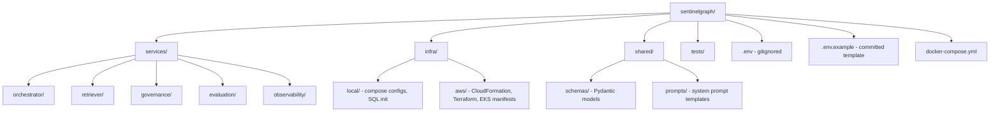
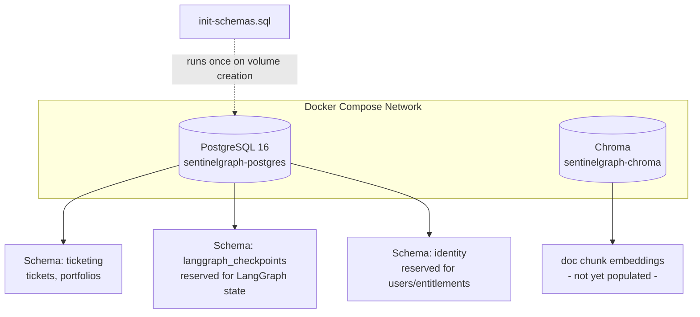
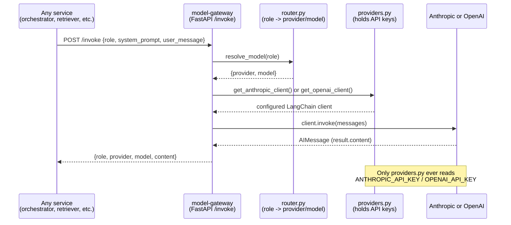
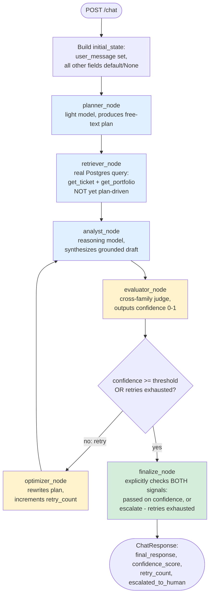
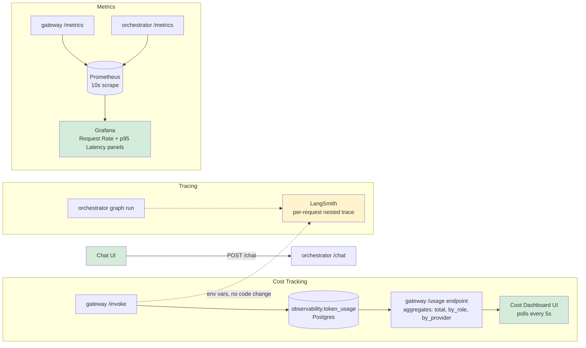
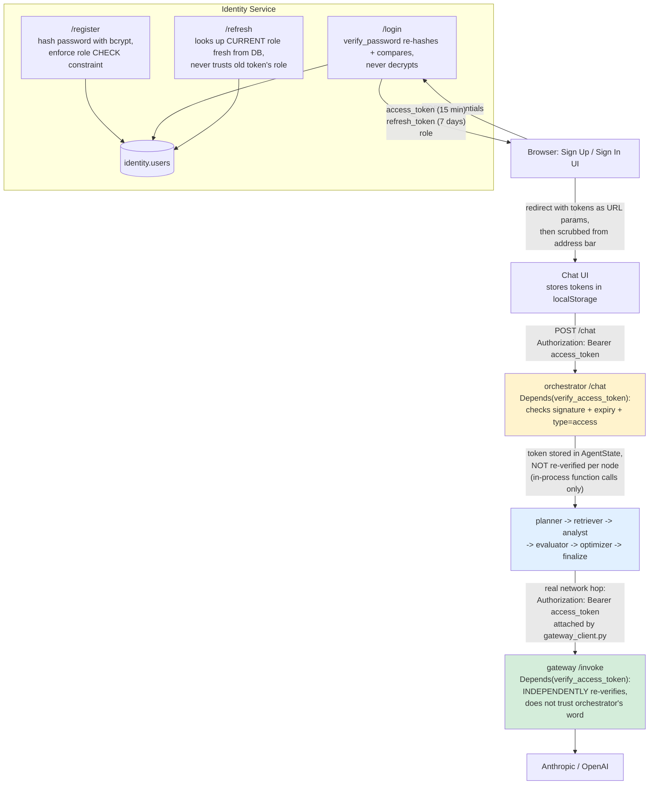
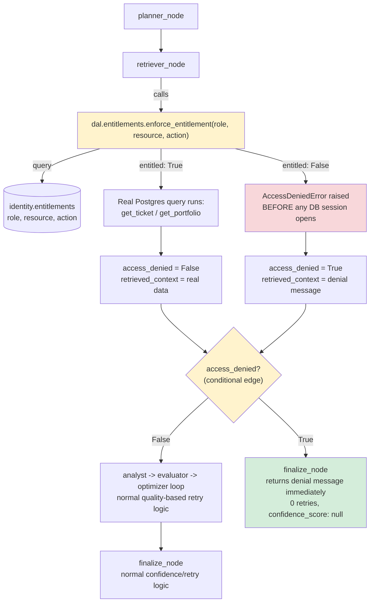
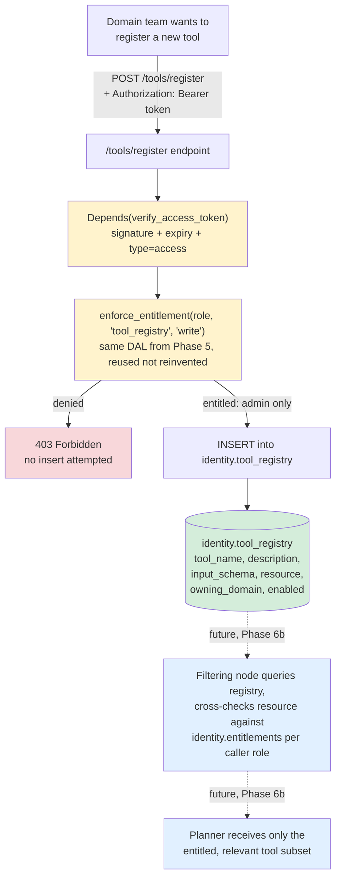
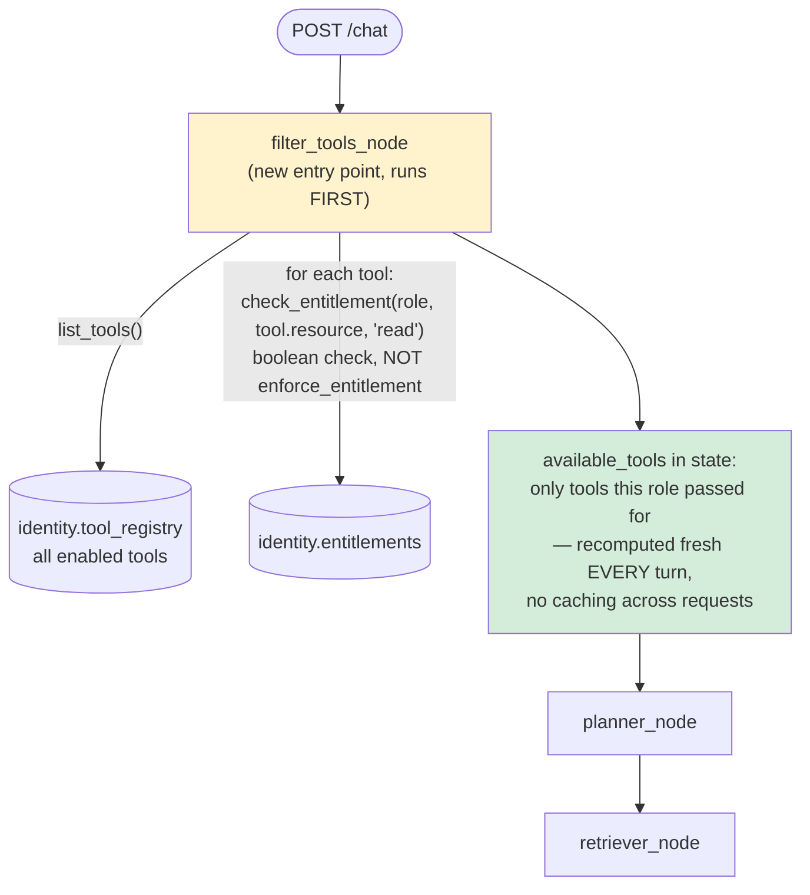
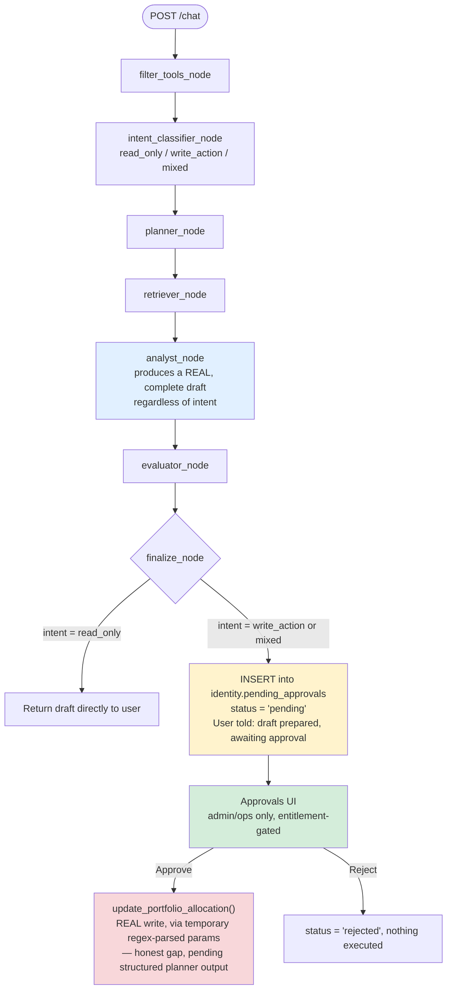

# SentinelGraph

SentinelGraph is a production-grade, governed agentic AI platform built as hands-on interview preparation, modeled on the class of problem BlackRock's Intelligence Servicing Platform (ISP) solves: a natural-language chat interface that lets enterprise users (portfolio managers, risk teams, operations analysts) run multi-step, tool-augmented investment workflows, with enterprise-grade identity propagation, layered guardrails, policy-enforced data access, an immutable audit trail, and full observability. The project is deliberately built local-first using Docker Compose, with an explicit, planned promotion path to AWS EKS, because that mirrors how a real platform team would develop: prove the architecture cheaply and quickly on a laptop before paying for and operating cloud infrastructure. The project was originally scaffolded with "Aladdin" in the name, but this was deliberately changed to "SentinelGraph" early on, because Aladdin is BlackRock's actual trademarked internal platform name, and using it in a personal, possibly-public repository risked implying an official affiliation that doesn't exist — a small but real judgment call about intellectual property hygiene that is itself worth being able to explain if asked.

## Phase 0: Repository Bootstrap, Secrets Strategy, and Git Discipline

The very first phase of the project involved no agent logic at all — it was purely about establishing the scaffolding that every later phase depends on: a coherent folder structure, a git repository with sane branching and commit conventions, and a secrets-handling strategy that would hold up even as the project grew. The reasoning behind starting here, before writing a single line of agent code, is that in a regulated environment like investment management, engineering discipline — reproducible environments, auditable git history, and secrets that never leak into version control — is not a "nice to have" layered on afterward; it is itself a signal of platform maturity that a Director-level engineer is expected to enforce from day one.

The folder structure was designed to mirror the eventual microservice boundaries of the system, rather than being organized as a single flat script collection. Under `services/`, each subfolder (`orchestrator`, `retriever`, `governance`, `evaluation`, `observability`) corresponds to a capability that will eventually be its own independently deployable, independently scalable container — this is a deliberate anticipation of the Kubernetes deployment model we will reach in later phases, where, for example, a spike in evaluator traffic can be scaled without touching the orchestrator at all. Alongside `services/`, an `infra/` folder holds environment-specific configuration split into `local/` (Docker Compose configs, SQL init scripts) and `aws/` (CloudFormation and eventually Terraform, and Kubernetes manifests), and a `shared/` folder holds cross-service code such as Pydantic schemas and prompt templates that more than one service needs to import.

Git was initialized with `main` as the primary branch, with an intended `develop` branch and `feature/*` branches for actual work — mirroring a real engineering team's workflow rather than committing directly to main. Commit messages follow the Conventional Commits convention (`feat:`, `fix:`, `chore:`, `security:`, and so on), which is a lightweight but real engineering-standards artifact: it makes git history scannable, supports automated changelog generation, and is exactly the kind of small standard a platform lead is expected to establish and enforce across a team, which maps directly to the JD's requirement to "establish and enforce engineering standards, design patterns, and best practices."

Secrets handling was established early and deliberately kept simple locally while being explicit about how it differs in production. Locally, a `.env` file holds real secret values (API keys, database passwords, JWT signing secrets) and is never committed to git — it is excluded via `.gitignore` from the very first commit, before any secret-bearing file could ever be staged. Alongside it, a `.env.example` file is committed to the repository; it lists every environment variable the application needs, populated with obviously-fake placeholder values, so that anyone opening the project (including a future version of the author) knows exactly what configuration is required without ever being exposed to a real credential. This is the standard local-development pattern, but it was explicitly discussed that it is not itself a production security model — a `.env` file sitting on a laptop is still a real leak vector through mechanisms like laptop theft, accidental inclusion in a zip archive, or a misconfigured backup. The plan, made explicit from this early phase, is that in production on AWS EKS there will be no `.env` file in the container image at all; instead, secrets will live in AWS Secrets Manager, synced into Kubernetes Secrets via the External Secrets Operator pattern, with pods authenticating to AWS via IRSA (IAM Roles for Service Accounts) rather than any static, long-lived AWS credential. This local-versus-production distinction — env file for developer velocity locally, Secrets Manager plus IRSA in production — is a legitimate, deliberate design decision to be able to narrate in an interview, not an oversight to be defensive about. It was also discussed that if a secret is ever accidentally committed, adding it to `.gitignore` afterward does not remove it from git's history; a real remediation would require history-rewriting tools such as `git filter-repo` or the BFG Repo-Cleaner, combined with immediate rotation of the leaked credential, since the old value must be treated as permanently compromised the moment it touches a shared repository.

During this phase, a genuinely useful clarifying discussion happened around tooling: the question of whether `.env` and `.env.example` belong at the project root came up (they do, alongside `docker-compose.yml`), and separately, whether `pyproject.toml` — seen in many modern Python repositories — is a superior replacement for `requirements.txt`. The honest answer is that `pyproject.toml` is indeed the more modern standard, increasingly used by tools like Poetry and uv to manage dependencies with proper lockfiles, project metadata, and build configuration all in one file, similar in spirit to `package.json` in the Node.js ecosystem. For a project of this size, however, `requirements.txt` remains simpler and is still what a large fraction of Docker-based Python microservices use in practice, so the decision was made to stay with `requirements.txt` throughout SentinelGraph rather than incur the complexity of switching mid-build for no functional benefit — a small but real example of choosing the boring, adequate tool over the newer one when the newer one doesn't change the outcome.

**Phase 0 structure at a glance:**

## Phase 1: Docker Compose — PostgreSQL Three-Schema Topology and Chroma

With the repository scaffolded, the first actual infrastructure decision was how to run PostgreSQL locally, and specifically why PostgreSQL rather than an alternative like local MySQL. The deciding factor was that LangGraph's built-in checkpointing mechanism — which persists agent execution state so that a conversation can be resumed, replayed, or audited — has native, first-class support for PostgreSQL as a backing store, and running Postgres in Docker from the very beginning keeps the local environment consistent with the eventual production path, where Postgres would run as Amazon RDS or as a Postgres deployment inside EKS. Using local MySQL instead would have introduced an unnecessary mismatch between local development and the intended production architecture for no compensating advantage.

A more subtle but important design decision made in this phase was how to handle the fact that a single Postgres instance ends up serving three conceptually distinct purposes in this system, a point that had originally been flagged as an architectural gap during interview preparation: Postgres needs to store business ticket state (the actual service tickets and portfolio records that the ISP-style workflows operate on), it needs to store LangGraph's own checkpointer tables (the internal execution state LangGraph uses to persist and resume a graph run), and eventually it will need to store identity and entitlement data (users, JWT-related metadata, and access-control tables). Rather than either conflating all of this into one undifferentiated set of tables, or over-engineering the solution by standing up three entirely separate Postgres instances from day one, the resolution chosen was to use **one Postgres instance with three separate schemas** — `ticketing`, `langgraph_checkpoints`, and `identity` — created via an initialization SQL script that Postgres runs automatically the first time its Docker volume is created. This gives each concern logical isolation (each schema can, in principle, have different access grants applied to it, so that, for example, the governance service could eventually be granted access to `identity` while being denied access to `langgraph_checkpoints`) while keeping operational overhead low: one connection pool, one backup job, one instance to reason about at this stage of the project. The schema-level isolation of `langgraph_checkpoints` in particular is what makes a real regulatory requirement tractable later: if BlackRock (or, in this simulated exercise, a compliance stakeholder) ever needs to prove months after the fact that a particular routing or retry decision the system made was deterministic and explainable, having the entire checkpoint history isolated in its own schema means an auditor can be pointed at exactly one well-defined part of the database rather than having to wade through unrelated business data. It was explicitly acknowledged that at true production scale, checkpoint volume alone — every state transition, retained for months for audit purposes — might eventually justify splitting `langgraph_checkpoints` onto its own dedicated Postgres instance for storage and I/O isolation, but that this would be the next scaling decision to make only once evidence of actual load demanded it, rather than something to speculatively over-build now.

Chroma was added in this same phase as the vector database that will back retrieval-augmented generation later in the project. It was deliberately brought in early, running as its own container, even though no document ingestion or embedding pipeline exists yet — the reasoning was to get the full Docker Compose topology (Postgres plus Chroma) stable and verified before any application code needed to depend on it, so that later phases could focus purely on application logic rather than debugging infrastructure and business logic simultaneously.

**Phase 1 topology at a glance:**

## Phase 2: Model Gateway — A Local Mimic of AWS Bedrock's Unified Model Access Pattern

This phase is one of the most important architectural decisions in the entire project, because it directly addresses a real pattern described by an actual BlackRock platform engineering leader (Lalit, in one of the reference interview transcripts used to prepare for this project) as the way BlackRock's own unified AI platform works: no individual team or service calls a model provider's API directly; instead, every call is funneled through a central gateway that holds the provider API keys, enforces rate limiting, tracks spend, and can swap model versions without requiring any downstream team to change its own code. AWS's actual product for this pattern is Bedrock, but Bedrock itself cannot be run inside a local Docker Compose environment, since it is a fully managed AWS service rather than an open-source piece of infrastructure. The solution adopted here was to build a small, purpose-written FastAPI microservice — `model-gateway` — that plays the identical architectural role locally: it is the only container in the entire system with access to the Anthropic and OpenAI API keys, it exposes a single `/invoke` endpoint that every other service calls over the network, and it is solely responsible for deciding which underlying provider and model actually handles a given request.

A deliberate and important design decision made explicit during this phase was that the gateway had to be built as a genuinely separate, network-isolated microservice with its own Dockerfile — not simply as a shared Python function that other services could import. This distinction matters architecturally: a shared function still executes inside whatever process imports it, meaning nothing would technically stop another service from also reading the same environment variables directly and bypassing the gateway; only a real network boundary, where the API keys live exclusively inside one container's environment and are never passed anywhere else, actually enforces the "only the gateway can call the model providers" guarantee. This is also why the project ended up with two different kinds of files side by side that initially caused some confusion: the top-level `docker-compose.yml` orchestrates multiple containers, and for off-the-shelf components like Postgres, Chroma, and MinIO it simply pulls a pre-built public image (using the `image:` key) because someone else has already written and published a Dockerfile for those. The `model-gateway` service, by contrast, is entirely custom code that nobody else has published an image for, so it needs its own `Dockerfile` and is referenced in Compose using the `build:` key instead — `build:` versus `image:` is the reliable tell for which services are off-the-shelf infrastructure and which are things we authored ourselves that need their own build recipe.

Internally, the gateway is split into three small files, each with a single, clear responsibility, which is itself a small but real software design decision worth narrating: `router.py` is nothing more than a lookup table mapping an abstract role name (`planner`, `retriever`, `analyst`, `evaluator`, `optimizer`) to a specific provider and model name; `providers.py` is the only file in the entire codebase that reads the actual `ANTHROPIC_API_KEY` and `OPENAI_API_KEY` environment variables and constructs the corresponding LangChain client objects; and `main.py` wires these together behind the single `/invoke` FastAPI endpoint, which accepts a role, a system prompt, and a user message, and returns the model's response along with which provider and model actually served it. Concentrating all API-key access into one file (`providers.py`) means that if a third model provider were ever added, or if the key-retrieval mechanism changed (for instance, moving from reading a plain environment variable to fetching a secret from AWS Secrets Manager at pod startup once this is deployed to EKS), only that one file would need to change — every other file in the system, including every future LangGraph node that calls the gateway, would be completely unaffected, since as far as they are concerned they are just calling `get_llm(role)` or making an HTTP POST to `/invoke` and receiving text back.

The specific role-to-model assignments chosen were not arbitrary. The planner and retriever roles, which perform lightweight, largely structural work (turning a natural-language query into a short plan, or deciding which tool to call), are routed to a fast, inexpensive model, since their task does not require deep reasoning. The analyst role, which performs the actual grounded synthesis of a final answer from retrieved context, is routed to a more capable, reasoning-heavy model, since the quality of the final answer depends most heavily on this step. The evaluator role — the model that judges the analyst's output and produces a confidence score — is deliberately routed to a **different model family** than the analyst, a decision known as cross-family evaluation or judge decorrelation. The underlying rationale is subtler than it might first appear: cross-family evaluation is not primarily a cost or latency optimization, and in fact a same-provider call and a cross-provider call are roughly equivalent in per-token cost and latency for comparable model tiers — the actual benefit of decorrelation is that if the same model family both generates and judges its own output, any systematic blind spot or bias shared across that family's models could cause the evaluator to rubber-stamp a flawed response, whereas an independently-trained model family is much less likely to share that exact blind spot. The real costs of going cross-family are operational rather than computational — running two vendor SDKs and two separate rate-limit budgets to monitor, losing the ability to exploit provider-specific prompt caching across the generation and evaluation calls if they shared a large common context, and taking on a small amount of additional resilience risk, since an outage at one vendor now can affect evaluation even if generation is unaffected. Splitting traffic across two providers also has a genuine benefit that is easy to overlook: it provides rate-limit isolation, since a burst of evaluator calls does not compete against the analyst's own rate-limit budget the way it would if both roles hit the same provider. This whole line of reasoning — decorrelation over cost, named operational trade-offs, rate-limit isolation as a side benefit — is exactly the kind of precise, defensible answer to give if a panelist asks "why two model providers" and pushes on whether it's really about cost.

Prompt injection defense was also introduced at this phase, in the form of a shared block of instructional text — the injection defense block — that is prepended to every role's system prompt. Its content instructs the model to treat all user input, retrieved documents, and tool outputs strictly as data to be analyzed rather than as instructions to be obeyed, and explicitly tells the model not to comply with any embedded text that attempts to make it reveal its system prompt, override its role, or ignore its original task, regardless of what authority the injected text claims to have. This is only a first, relatively weak layer of defense: a system prompt instruction can meaningfully deter naive injection attempts, but it does nothing on its own to stop more sophisticated attacks such as base64-encoded payloads, injection carried indirectly through the content of a retrieved document or a tool's return value, or attacks that don't rely on the model "reading instructions" at all. Real defense in depth requires this system-prompt-level instruction to be paired with pattern-based input scanning at a guardrail layer (built in a later phase) and, most importantly, with the architectural principle that the LLM itself is never granted unmediated ability to write to a database, execute code, or call an external system without passing through a separate, non-LLM-controlled authorization check — a principle that becomes concrete once the Data Access Layer and Policy Enforcement Point are built in later phases. Being able to name this limitation unprompted, rather than overclaiming that a system prompt "solves" injection, is itself a signal of production maturity worth demonstrating in an interview answer.

**Phase 2 request flow at a glance:**

## Phase 3: Basic LangGraph Orchestrator — Real Postgres, Async Nodes, Bounded Retry Loop

Phase 3 is where the project stops being infrastructure and becomes an actual agentic system. The orchestrator service implements a five-role LangGraph pipeline — planner, retriever, analyst, evaluator, and optimizer — wired together into a StateGraph with one conditional branch, and every part of it was built to real production standards rather than as a toy: real PostgreSQL queries instead of mock data, prompts loaded from versioned YAML configuration instead of hardcoded strings, explicit injection-defense tagging around every piece of untrusted content, fully asynchronous execution from the HTTP layer down through the model calls, and an explicit, configurable loop-termination mechanism rather than an implicit one.

### Shared State and the Real Postgres Data Layer

The entire pipeline is coordinated through a single shared state object, `AgentState`, defined as a `TypedDict` rather than a Pydantic `BaseModel`. This distinction matters and is worth being able to explain precisely: a `TypedDict` is purely a compile-time and editor-time type hint over a plain Python dictionary, with no runtime validation cost, whereas a Pydantic `BaseModel` performs runtime validation on every instantiation. LangGraph's core mechanism is to have each node return a partial dictionary of updates that get merged by key into the running state, which is a natural fit for plain dictionaries and would incur unnecessary validation overhead on every single node transition — including every pass through a retry loop — if state were instead modeled as a Pydantic object. Pydantic is still used elsewhere in this same service, specifically for the FastAPI request and response models (`ChatRequest`, `ChatResponse`), because those genuinely cross a trust boundary — they are parsing untrusted JSON arriving over the network — whereas `AgentState` is only ever constructed by our own code and never needs that runtime enforcement. This is a good general principle to carry into the interview: use runtime-validated schemas at trust boundaries, and lighter, validation-free type hints for internal data that never leaves your own process.

Retrieval in this phase is backed by real PostgreSQL tables in the `ticketing` schema — a `tickets` table and a `portfolios` table — populated with a small set of seeded rows via genuine `INSERT` statements in `init-schemas.sql`, not by a Python dictionary standing in for a database. The connection layer (`db.py`) creates one pooled SQLAlchemy engine per service, with `pool_size` and `max_overflow` explicitly bounded, which matters because PostgreSQL enforces a hard cap on total concurrent connections, and every additional service that opens its own uncontrolled connection pool is a classic, real way to exhaust that cap under load — tuning the pool is a legitimate first lever to reach for before more drastic scaling measures like read replicas or a connection multiplexer such as PgBouncer become necessary. The table structures themselves are mapped into Python via SQLAlchemy's ORM (`models.py`), and the actual query functions (`repository.py`) use the ORM's filter methods rather than any hand-built SQL string, which is what gives automatic protection against SQL injection: SQLAlchemy parameterizes every value passed through `.filter(Ticket.ticket_id == ticket_id)`, so user-supplied values are never concatenated directly into a SQL string. It was explicitly acknowledged during this phase that these repository functions remain synchronous even though the rest of the service is asynchronous, because true async database access would require swapping the underlying driver from `psycopg2` to `asyncpg` and moving to SQLAlchemy's async engine and session classes — a real, larger piece of work that was deliberately deferred rather than faked, since FastAPI already runs synchronous route handlers in a thread pool and so does not block other requests even with a sync data layer at today's scale; at BlackRock's actual concurrency volumes, this would be one of the next concrete upgrades to make, and being able to name it as a conscious sequencing decision rather than an oversight is a good, honest answer if a panelist probes on it. It was also explicitly decided, after discussion, that seeding tickets and portfolios directly via SQL at container startup is acceptable only as bootstrap scaffolding for this phase — the real, permanent path for a portfolio manager or operations user to create a ticket through natural language will be built once intent classification (Phase 6.5) can distinguish a write action from a read-only query and route it through mandatory human-in-the-loop approval, and once a proper UI (Phase 14) exists; direct SQL inserts are not the intended production ticket-creation mechanism and were never meant to be.

### The Model Gateway Client, Made Fully Asynchronous

A deliberate architectural decision made partway through this phase was to convert the entire service to asynchronous execution, specifically because the dominant cost of every node in this graph is waiting on an LLM API call, which is a nearly pure I/O-bound operation that can take anywhere from one to several seconds. Under synchronous execution, one in-flight request waiting on a slow model call would block the entire process from handling any other incoming request; under asynchronous execution using `httpx.AsyncClient` for the gateway calls and `async def` node functions throughout, the event loop can serve other concurrent requests while any individual one is waiting on I/O, which is the real concurrency benefit relevant to a BlackRock-scale system with many portfolio managers issuing requests simultaneously. This required three coordinated changes: the client that calls the Model Gateway (`gateway_client.py`) was rewritten around `httpx.AsyncClient` instead of the synchronous `requests` library; every node function in `nodes.py` that makes an LLM call became `async def` and uses `await call_model(...)`; and the FastAPI endpoint itself, along with LangGraph's own invocation (`compiled_graph.ainvoke(...)` rather than `.invoke(...)`), was updated to match. The one deliberate exception is `finalize_node`, which makes no LLM call at all and was left as a plain synchronous function, since LangGraph supports mixing synchronous and asynchronous nodes freely within the same graph, and there is no benefit to forcing an `async def` onto a function that does no I/O.

### Versioned Prompts and Layered Injection Defense

System prompts for every role are stored as versioned YAML files under `shared/prompts/` (`planner_system.yml`, `analyst_system.yml`, `evaluator_system.yml`, `optimizer_system.yml`), each carrying a `version` and `last_updated` field, and are loaded at runtime through a small shared utility, `load_prompt(role)`, rather than being hardcoded as string literals inside node functions. This is a deliberate, config-driven design decision rather than a stylistic preference: it means a prompt can be revised, rolled back, or audited independently of any code deployment, which is precisely the kind of "prompt tuning and prompt versioning at scale" maturity a platform-engineering interview is likely to probe for, and it also means the same prompt text cannot silently drift out of sync between multiple call sites the way a copy-pasted string easily could.

Every role's prompt is prefixed with a shared injection-defense block loaded from its own YAML file, and this block was strengthened during this phase with a specific, concrete technique: any content that originates from the user, from retrieval, or from a prior agent's own output is wrapped in explicit `<untrusted_input>` XML-style tags before being interpolated into a prompt, and the injection-defense instructions explicitly tell the model that everything inside those tags is data to be analyzed and never an instruction to be obeyed, regardless of how authoritatively it is phrased. This tagging approach is meaningfully stronger than relying on instructional text alone, because it gives the model an unambiguous, structural boundary to reason against rather than requiring it to infer from context which parts of a long prompt are trustworthy instructions and which parts are untrusted data. It was explicitly acknowledged, and is worth being able to state plainly in an interview rather than glossing over, that this defense has a known, currently unaddressed gap: there is no escaping or sanitization of literal tag-like substrings within the underlying user input, so a sufficiently adversarial input containing a literal closing tag sequence could in principle attempt to forge a premature tag boundary and smuggle content outside the intended data region. The correct fix — sanitizing or escaping any tag-like substrings before wrapping untrusted content — is deliberately deferred to the guardrails phase, since it belongs alongside the other pattern-based input scanning being built there, and naming this limitation unprompted is itself a stronger signal of production maturity than either claiming the defense is complete or leaving the gap unmentioned.

### The Five Nodes and the Explicit, Configurable Retry Loop

The planner node takes the raw user message, wrapped in the untrusted-input tags, and produces a short free-text plan describing what data should be retrieved. It is important to be precise about a real, currently accepted limitation here rather than overstating this node's sophistication: the plan produced today is advisory only. The retriever node does not parse or act on it — it is currently hardcoded to always fetch a fixed ticket and a fixed portfolio record from Postgres, regardless of what the planner actually said should be retrieved. This is intentional, not an oversight, and the reason is architectural: meaningful tool-selective retrieval requires the planner to choose from an actual, finite, known set of callable tools, and no such registry exists yet at this point in the build. Building fake structured-output tool selection now, with nothing real for it to select from, would only be theater. The genuine fix is scheduled for Phase 6a, which builds a real Postgres-backed Agent/Tool Registry that domain teams can register capabilities into, and Phase 6b, which adds a distinct filtering node that narrows that full registry down to a relevant, authorized subset before the planner ever sees it — at which point the planner will be upgraded to genuine structured output validated against a Pydantic schema constrained to that filtered tool list, with a guardrail layer retrying on any malformed output. This sequencing — defer structured planning until there is a real registry to plan against, rather than fake it early — was an explicit, deliberate choice, and is a good example to cite if asked how you sequence build-out of a complex agentic system realistically.

The analyst node combines the plan and the retrieved context into a grounded draft response using a reasoning-heavy model, and is explicitly instructed to include a disclaimer whenever it produces anything resembling a financial recommendation. The evaluator node, using a model from a different provider family than the analyst for decorrelation reasons already established in Phase 2, is asked to return a single confidence score between zero and one; this score is parsed with a bare `try/except` around `float()`, defaulting to zero on any parse failure, which is a knowingly fragile mechanism accepted for this phase and scheduled for replacement with proper Pydantic-validated structured output and a retry-on-malformed-output guardrail once the guardrails phase is reached. If the score falls below threshold, the optimizer node rewrites the instructions given to the analyst based on what appeared to go wrong and increments a retry counter, and control loops back to the analyst node to try again — but only up to a configurable maximum number of attempts.

Both the confidence threshold and the maximum retry count were deliberately made configurable via environment variables (`CONFIDENCE_THRESHOLD`, defaulting to `0.9`, and `MAX_RETRIES`, defaulting to `3`) rather than hardcoded inline, centralized in a single `config.py` file that both `graph.py` and `nodes.py` import from, so that operations staff could tighten the threshold in a stricter compliance environment or adjust the retry budget without a code change or redeploy. A related and important refinement made during this phase concerns exactly how the loop terminates. The finalize node was rewritten to check both relevant signals explicitly and independently — whether the confidence score actually cleared the threshold, and separately, whether the retry budget has been exhausted — rather than relying on the fact that, in the original version, checking only the confidence score happened to produce the correct escalation behavior as an implicit side effect of retries always being exhausted by the time the score was still failing. Making both conditions explicit, and adding a defensive fallback branch that escalates rather than silently returning an unvalidated draft in the case where neither expected condition is actually true, is a small but real illustration of the general engineering principle that a system's safety-critical branching logic should state its assumptions openly rather than relying on incidental behavior that happens to be correct today but could silently break if the surrounding code changes later. This exact mechanism — an explicit conditional edge function inspected after the evaluator node runs, checking confidence against threshold and retry count against a maximum, routing to either the optimizer or directly to finalize — is the concrete, demonstrable answer to the "how do you prevent an unbounded agent loop" question that came up directly in the interview preparation transcripts.

One instructive result surfaced during manual testing of this loop is worth remembering precisely. A deliberately ungrounded question with no real data behind it ("what do you think about the market today") did not trigger a retry as might have been expected; instead, the analyst honestly recognized it had no real market data available and offered a transparent, appropriate deflection back toward what it could actually help with, and the evaluator scored that honest deflection with high confidence, since by its literal rubric the response genuinely was grounded and appropriate given the available context — it was simply not an answer to the literal question asked. This reveals a real, subtle gap worth naming candidly in an interview setting: the evaluator's groundedness rubric does not currently distinguish between a confidently correct answer and a confidently honest non-answer to an out-of-scope request, and a more complete system would likely need an additional relevance or in-scope classification signal — conceptually adjacent to, though distinct from, the read/write/mixed intent classification planned for Phase 6.5 — evaluated before or alongside groundedness, specifically to catch and route this class of situation rather than have it pass evaluation by default.

### Wiring, the LangGraph API, and Debugging Notes Worth Remembering

The graph itself is assembled in `graph.py` using `StateGraph(AgentState)`, with each node registered by name via `add_node`, a linear sequence of plain edges from planner through retriever, analyst, and evaluator, and a single `add_conditional_edges` call attached to the evaluator node. This conditional-edge mechanism works by calling a plain Python function after the evaluator node completes, which returns a short string label ("retry" or "finalize"), and a dictionary maps each possible label to the actual registered node name to transition to next — the condition function itself only needs to express an abstract decision, and the dictionary is what wires that decision to concrete graph nodes, which keeps the two concerns cleanly separated. By contrast, the edge from the optimizer node back to the analyst node is a single plain edge, not a conditional one, and understanding why clarifies how LangGraph's branching actually works: the decision of whether to retry at all was already made one step earlier, at the evaluator's conditional edge: by the time execution is inside the optimizer node, retrying has already been committed to, and the optimizer's only possible next step is always the analyst, so no further branching decision exists at that point — a conditional edge is only needed where a node genuinely has more than one possible successor depending on runtime state.

`compiled_graph = build_graph()` executes at module import time, not inside any request-handling function, which means the graph is constructed and compiled exactly once when the service process starts, and every subsequent incoming chat request reuses that same compiled object rather than paying the cost of rebuilding the graph's structure on every single call — the same general pattern as creating a database connection pool once at startup rather than opening a fresh connection per request.

Two categories of real debugging issues surfaced during this phase are worth remembering precisely, because they reflect genuine production-relevant lessons rather than incidental typos. First, a single-character typo in the `AgentState` TypedDict definition (`user_mesage` instead of `user_message`) caused LangGraph to silently drop the `user_message` key from its internal state entirely, rather than raising any error — because LangGraph builds its internal state channels strictly from the declared schema, any key present in the data but absent from the schema is simply not tracked, which produced a confusing downstream `KeyError` inside the planner node rather than an error at the point of the actual mistake. This is a good illustration of why schema-driven systems can fail silently at a distance from their root cause, and why deliberately adding temporary diagnostic print statements at each layer of a call chain — confirming the request payload, then the state immediately before invocation, then the state as received inside the first node — is often the fastest way to localize exactly where a value disappears. Second, and architecturally more significant, was a Docker build-context issue: the orchestrator's `Dockerfile` originally used `services/orchestrator` as its build context, which meant Docker had no visibility into the `shared/prompts` directory at all during the image build, since that directory lives outside the build context entirely — the `sys.path.append` trick used to make `shared/prompts` importable worked correctly during local development on the host machine, where the relative directory structure genuinely exists two levels up, but failed inside the container, where the `shared` folder had simply never been copied in. The fix was to change the build context to the project root itself and explicitly copy both `services/orchestrator/` and `shared/` into the image, and to correct the runtime import path to match the resulting in-container layout. This is a genuinely common category of bug in multi-service Docker Compose projects — a shared module that works locally but is invisible to a container because the build context was scoped too narrowly — and is worth being able to describe precisely if a similar architecture comes up in discussion.

**Phase 3 flow at a glance:**

## Phase 3.6 and the Brought-Forward Observability Stack: Cost Tracking, LangSmith, Prometheus/Grafana, and the First Two UIs

This chunk of work departed from strict phase-by-phase sequencing on purpose. The original plan placed LangSmith and Prometheus/Grafana all the way in Phase 12, bundled together as a single "complete observability" phase to be built once guardrails, the registry, and entitlements existed. Partway through, it became clear that two of those three pieces had no real dependency on anything not yet built, and delaying them further would only mean losing the chance to build intuition about the system's behavior while it was still simple enough to reason about end to end. The decision made was to explicitly pull three things forward — token/cost tracking, LangSmith tracing, and Prometheus/Grafana metrics — while deliberately continuing to defer two other pieces that were also requested at the same time — a user registration screen and a document upload button — because those two would have had nothing real to connect to and would have violated the no-fake-data standard held throughout this project. This is worth being able to explain precisely in an interview: bringing observability forward was safe because it is purely additive instrumentation wrapped around already-working code, whereas bringing forward UI for not-yet-built backend capability would have meant either decorative, non-functional screens or a disorderly jump past several intentionally sequenced phases.

### Real Token Usage and Cost Tracking at the Model Gateway

The Model Gateway is the single point every LLM call already passes through, which makes it the natural, and only necessary, place to capture real spend data — no other service needed to change. It is important to be precise about what is genuinely measured here versus what is computed: neither the Anthropic nor the OpenAI API ever returns a dollar cost directly in its response. Both APIs return only token counts — real, provider-reported input and output token counts, exposed consistently through LangChain's `usage_metadata` field regardless of which provider actually served the call — and cost is then computed on our own side by multiplying those real token counts against a maintained price-per-model table. This is not a shortcut particular to this project; it is exactly how a tool like LangSmith computes the cost figures it displays as well, since no vendor API exposes billing information at the level of an individual call. The price table itself lives as a separate, versioned YAML file (`pricing.yml`) rather than being hardcoded as constants in Python, carrying a `last_updated` field, specifically because vendor pricing is an external fact that changes over time and needs to be manually refreshed against the vendor's own pricing page — this is a real, ongoing maintenance responsibility of any cost-tracking system built this way, worth naming candidly rather than presenting the numbers as if they were somehow authoritative forever.

Every invocation now writes one row to a new `observability.token_usage` table — role, provider, exact model name, input tokens, output tokens, computed cost, and a timestamp — deliberately placed in its own schema rather than folded into `ticketing` or `identity`, following the same one-schema-per-distinct-concern principle established back in Phase 1. The gateway gained its own Postgres connection for this purpose (a `db.py` and `models.py` scoped only to this one table, following the identical pooled-engine pattern used by the orchestrator), and the actual logging happens in a small `_log_usage` helper that is deliberately wrapped in its own try/except inside the `/invoke` endpoint: a failure to write the usage row is logged as a warning but never allowed to fail the actual request, since the real LLM call has already succeeded by that point and the caller should still receive their answer regardless of whether the bookkeeping succeeded. A `/usage` endpoint was then added that aggregates this table — total cost, total call count, and both a per-role and a per-provider cost/call breakdown — using real SQL aggregate functions (`func.sum`, `func.count`, `group_by`) rather than pulling all rows into Python and summing them there, which is both the correct and the only approach that would remain performant as this table grows into the hundreds of thousands of rows a production system would eventually accumulate.

### LangSmith: What It Actually Shows and Why It Required No Code Changes

LangSmith is a tracing and observability platform purpose-built for LLM applications, and it is worth being precise about what distinguishes it from the cost dashboard just described and from Prometheus/Grafana, described next, since all three can appear to overlap on the surface. LangSmith's real value is deep, per-request tracing: for any single chat request, it shows the complete nested call tree — which node ran, in what order, how long each step took, and the exact prompt and response text at every step — which makes it the tool of choice for understanding or debugging why one particular request behaved the way it did. This is a fundamentally different question from "what is our aggregate spend," which the cost dashboard answers, or "is the system healthy right now across all traffic," which Prometheus and Grafana answer.

Enabling LangSmith required no changes at all to any node function, any prompt, or any piece of application logic — LangChain and LangGraph detect a small set of environment variables at runtime and begin automatically sending trace data for every `client.invoke()` call and every graph node execution. Because two generations of environment variable names exist across different versions of the LangChain ecosystem — the newer `LANGSMITH_API_KEY` / `LANGSMITH_PROJECT` / `LANGSMITH_TRACING` names and the older `LANGCHAIN_API_KEY` / `LANGCHAIN_PROJECT` / `LANGCHAIN_TRACING_V2` names — both sets were set to the identical key and project values in `.env` and passed through to both the gateway and orchestrator containers, since it was not immediately obvious which set the installed package version would actually read, and setting both is a safe, low-cost way to avoid a silent no-op. Once correctly wired, real traces began appearing in the LangSmith project dashboard for every chat request, showing the full planner-to-evaluator call chain with per-step latency and content — a genuinely useful, and importantly honest, debugging surface, since it also plainly exposed the retriever's current hardcoded-retrieval limitation in action: asking an unrelated question like a casual greeting still produced a trace showing the same fixed ticket and portfolio data being retrieved regardless of the actual question asked, which is a concrete, visual demonstration of the intentionally deferred tool-selection gap already documented for Phase 6a/6b.

### Prometheus and Grafana: Aggregate, Time-Series Operational Health

Prometheus and Grafana answer a different question than either of the two tools above: not "what did this one request do" and not "what is our total spend," but "is the system healthy right now, and how has that changed over time, across all traffic." This is the category of monitoring that becomes essential at real production scale, where the interesting failures are things like a latency percentile creeping upward over an hour or an error rate spike correlated with a deploy — patterns that are invisible from inspecting individual traces one at a time and are not the kind of question a per-call cost dashboard is built to answer either. Enabling this required minimal code change: the `prometheus-fastapi-instrumentator` library was added to both the gateway and orchestrator services, and a single `Instrumentator().instrument(app).expose(app)` call was added to each service's `main.py`, which automatically exposes a `/metrics` endpoint in Prometheus's standard text exposition format, tracking request counts and latency histograms per route with no further manual instrumentation.

A Prometheus container was then added to the Compose stack, configured via a scrape config file (`infra/local/prometheus.yml`) that polls both services' `/metrics` endpoints every ten seconds using their Docker-internal service names — `model-gateway:8080` and `orchestrator:8090` — which only resolve inside the Docker network and are not reachable from a host-machine browser, a distinction that caused some initial confusion when clicking those exact URLs from Prometheus's own target-health page returned a "page cannot be displayed" error; this was expected and correct, since those links are Prometheus's internal scrape targets, not user-facing pages, and the two names only exist as hostnames within Docker's own internal DNS. A Grafana container was added alongside it, connected to Prometheus as a data source using that same internal hostname pattern (`http://prometheus:9090`), and two working dashboard panels were built using raw PromQL queries entered directly rather than through Grafana's metric-picker UI, since the underlying query language is what is actually worth understanding: `rate(http_requests_total[1m])` for request throughput, and `histogram_quantile(0.95, rate(http_request_duration_seconds_bucket[5m]))` for p95 latency — the standard percentile-based way production systems describe "how slow is the slowest meaningful fraction of traffic," which is a materially more honest description of user-facing performance than a simple average would be, since an average can look perfectly healthy while a real fraction of users experience unacceptably slow responses. A third planned panel for 5xx error rate was left as an open item, a minor loose end rather than a blocking one, since the two working panels already demonstrate the pattern and mechanism completely.

### The Cost/Token Dashboard and the Real Chat UI

With Phase 3.6 producing genuine rows in Postgres and a genuine `/usage` endpoint to read them from, a small standalone dashboard was built as static HTML and JavaScript, served by its own lightweight nginx container — following the same "every capability gets its own service" pattern used throughout this project rather than folding it into an existing service. The dashboard polls `/usage` every five seconds and renders total spend, total call count, and both breakdowns as plain HTML tables, deliberately built without a frontend framework since the actual complexity here is in the data being real, not in the presentation layer. Enabling this required adding permissive CORS middleware to the gateway's FastAPI app, since a browser page served from one port is blocked by default from calling an API served on a different port unless the API explicitly allows it — a genuinely common category of confusion when first exposing a backend service to direct browser access rather than only to other backend services or command-line tools.

The chat interface followed the identical reasoning: a real, functional UI built against the already-working `/chat` endpoint on the orchestrator, rendering conversation history with the user's messages and the assistant's responses styled distinctly, and surfacing the evaluator's confidence score and retry count beneath each response as small metadata, exactly mirroring what the cost dashboard already does with usage data — real backend data displayed honestly, nothing invented in the presentation layer. The one deliberately unusual design decision in this interface was the attachment/upload icon: rather than omitting it entirely or building it as a fully working feature ahead of the MinIO ingestion pipeline that does not yet exist, it was built visibly present but disabled, with a tooltip explaining that document upload arrives in a later, specifically named phase. This was a conscious compromise between two worse alternatives — a functionless button that silently does nothing when clicked, which is dishonest UI, or building real upload functionality far out of sequence just to make the icon clickable — and is itself a legitimate, defensible product and engineering decision worth citing if asked how a roadmap gets communicated honestly inside a shipping interface rather than only in a separate document nobody reads.

**Phase 3.6 and observability stack, at a glance:**

## Phase 4: Identity & Auth — Real Users, Password Hashing, JWT Access/Refresh Tokens, and the First Real Token-Propagation Hop

This phase builds the identity layer that everything from here forward depends on: a real `identity.users` table, a dedicated Identity microservice that owns registration and login, JSON Web Tokens for proving identity across requests, and — critically — the first genuine demonstration of a security token actually crossing a real service-to-service network boundary rather than just existing inside one process. This phase directly targets the gap surfaced repeatedly across the interview preparation transcripts: Lalit's questioning specifically probed whether the token/scope/identity-propagation mechanics were understood at a level deeper than vocabulary, and this phase is where that understanding was built and made concretely demonstrable rather than theoretical.

### Passwords, Hashing, and Why Nothing Is Ever Decrypted

User passwords are never stored in plain text and never stored using reversible encryption either — they are hashed using bcrypt, a deliberately slow, salt-embedding one-way hashing algorithm. The distinction between hashing and encryption matters and is worth being precise about: encryption is reversible given the right key, hashing is not reversible under any circumstance, by design. When a user registers, bcrypt generates a random salt, combines it with the plain-text password, and produces a single hash string that has that salt embedded directly inside its own format — this is why no separate database column or lookup is needed to retrieve the salt at login time; the stored `password_hash` value already contains it. When a user logs in, the system does not decrypt anything — it re-hashes the freshly submitted password using the salt extracted from the already-stored hash, and compares the two resulting hashes for equality. If they match, the password was correct; if they don't, it wasn't — the actual original password is never recovered or recoverable at any point, including by the system itself.

Two follow-up questions surfaced during this phase are worth recording precisely, since they reflect exactly the kind of "do you actually understand this or just use the library" probing a technical interviewer might apply. First: could two different password-and-salt combinations ever accidentally produce the same hash? In principle yes — this is called a hash collision — but bcrypt's output space is large enough (184 bits) that this is considered computationally infeasible with any current or foreseeable technology, the same category of guarantee underlying essentially all modern cryptography; the salt's actual purpose is not to prevent collisions but to prevent an attacker from precomputing a single giant table of hash-to-password mappings and reusing it against every user in the database, since a different salt per user means that precomputed table would need to be redone per user, per guess. Second: what happens if a user's role changes while their access token is still valid? The honest answer is that the change does not take effect until the current access token expires and a new one is issued — this is a known, accepted characteristic of stateless JWTs generally, not a bug, and is precisely why access tokens are kept short-lived (fifteen minutes here) rather than long-lived: the shorter the lifetime, the smaller the window during which a stale role or a stolen token remains usable. A production system with a stricter revocation requirement would additionally maintain a token blocklist checked on every request, deliberately reintroducing a database lookup specifically for that one narrow purpose — this was not built in this phase and is worth naming as a real, deliberate gap rather than glossing over it.

### Access Tokens, Refresh Tokens, and What "Authorization Token" Actually Means

Three pieces of terminology came up during this phase and are worth defining with precision, since conflating them was part of the originally exposed interview gap.

The **access token** is a short-lived credential, issued at login and attached to every subsequent request as an `Authorization: Bearer <token>` HTTP header, that lets a server verify who is calling without requiring a password on every single request. It is deliberately short-lived — fifteen minutes in this system — specifically so that if it is ever stolen, its window of usefulness to an attacker is small. Its payload carries the user's ID and role, both of which the server can trust once the token's cryptographic signature has been verified, without needing to query a database for basic identity facts on every request.

The **refresh token** is a separate, long-lived credential — seven days here — whose only purpose is obtaining a new access token once the old one expires, without forcing the user to re-enter a password. It is never sent to any application endpoint directly; it is only ever sent to a dedicated `/refresh` endpoint. Because it is long-lived, it is inherently more dangerous if stolen than an access token, and a hardened production implementation would store it in an httpOnly cookie inaccessible to JavaScript rather than in browser `localStorage`, which is what this project currently uses for local-development simplicity — a deliberate, explicitly acknowledged simplification, not a production-ready pattern, and one specifically worth naming unprompted if asked how this would differ in a hardened deployment. A specific design decision worth recording: the refresh token's payload deliberately carries no role claim at all. When `/refresh` is called, the user's current role is looked up fresh from the database every time, rather than being trusted from any previously issued token — this is exactly what makes a role change take effect promptly on next refresh, rather than being silently carried forward, stale, for up to seven days by an old refresh token that happened to embed an outdated role.

The term **"authorization token"** is not a third, distinct token type in this system — it is the informal, general term people commonly use to mean "whatever token is being used to prove authorization for a given request," which in this system's terminology is the access token. Related, but genuinely distinct from which token is held, is the concept of **scope** — what an authenticated identity is actually permitted to do, as opposed to merely who they are. This system currently uses `role`, embedded directly in the access token's payload, as a coarser-grained stand-in for true scope: the token asserts "this caller is a `portfolio_manager`," and the entitlement tables built in Phase 5 will be what actually translates that role into specific allowed or denied actions. A more granular system might instead issue explicit scope claims directly (for example `"scopes": ["read:tickets", "write:allocations"]`), letting a downstream service check a specific permission without a separate database lookup at all. Starting with role-based coarse-grained authorization and evolving toward explicit scopes only if warranted was a deliberate sequencing decision, not an oversight, and is worth presenting exactly that way if probed on it.

### The Real Users Table, the Identity Service, and the Registration/Login UI

A real `identity.users` table was added, constrained at the database level — not merely in application code — by a `CHECK` constraint enumerating the five valid roles for this platform (`admin`, `portfolio_manager`, `ops`, `external_client`, `risk_analyst`), so that an invalid role can never be inserted even by a future application bug elsewhere in the stack. A new, dedicated Identity microservice was built to own this table exclusively, exposing `/register`, `/login`, and `/refresh` endpoints — following the same "one distinct capability, one service" pattern used throughout this project rather than folding user management into the orchestrator or gateway. The login endpoint deliberately returns an identical error message whether the submitted user ID does not exist at all or exists with the wrong password, specifically to prevent an attacker from being able to enumerate which user IDs are valid by observing different error responses.

A functional signup and sign-in UI was built directly against these real endpoints — collecting user ID, email, password, a confirm-password field checked for an exact match before submission, and a role dropdown populated with the same five roles enforced at the database level — and, on successful login, redirects the browser to the chat interface, carrying the freshly issued access token, refresh token, role, and user ID forward as URL query parameters, which the chat UI reads once on load, stores, and then immediately scrubs from the visible address bar using `history.replaceState`. This URL-parameter handoff between two separately hosted static pages is itself a deliberate, named simplification worth being able to discuss candidly: passing tokens through a URL, even briefly, means they can appear in browser history entries before being scrubbed, and a more hardened architecture would likely use a shared authentication domain or a proper single-page application router instead of two independently hosted static sites communicating via redirect parameters.

### Making the Verification Real: The `/chat` Endpoint, and the Correction That Followed

The first concrete implementation step added a FastAPI dependency, `verify_access_token`, to the orchestrator's `/chat` endpoint. This function extracts the bearer token from the incoming `Authorization` header and calls a standard JWT library's decode function, which performs two genuinely cryptographic checks — verifying the token's signature against the shared `JWT_SECRET` (proving it was actually issued by the Identity service and has not been tampered with) and checking the token's expiry claim — before a final, simpler application-level check confirms the token's `type` claim is `access` rather than `refresh`, preventing a refresh token from being mistakenly accepted where an access token is required. Testing this directly and concretely — one request with no token, confirmed to fail with a clean 401 and the correct error message, and one authenticated request from the real signed-in UI, confirmed via a temporary debug log line to show the correctly decoded `user_id` and `role` — was the first real, demonstrable proof that identity verification, not just token issuance, was genuinely working.

It's important to be precise about exactly what this first step did and did not achieve, because a real gap surfaced immediately afterward. Verifying the token once at the `/chat` endpoint means the request is authenticated at the front door — but the five LangGraph nodes that then execute (planner, retriever, analyst, evaluator, optimizer) are not separate agents or services at all; they are ordinary Python function calls chained together within one single running process inside the orchestrator's own container. There is no network hop between them, and therefore nothing resembling "token propagation" is meaningfully at stake purely in how those five functions call each other — this had to be stated explicitly rather than left implicit, since conflating in-process function chaining with genuine agent-to-agent communication would be a real and easily-probed misunderstanding in an interview setting.

The one place a genuine service-to-service network hop does exist in this system today is the orchestrator's call out to the Model Gateway's `/invoke` endpoint — a real HTTP request crossing a real container boundary — and this hop, at the point the gap was noticed, was not carrying the user's identity at all. This was corrected directly: the verified access token's raw string is now threaded through `AgentState` itself as a new field, so every node function that needs to call the gateway has access to it, and `gateway_client.py`'s `call_model` function now attaches it as a genuine `Authorization: Bearer` header on its outbound HTTP call to the gateway. The Model Gateway, in turn, was given its own copy of the identical JWT verification logic and now independently re-verifies the token on every `/invoke` call, rather than trusting the orchestrator's prior verification implicitly. This is the concrete implementation of a principle worth stating precisely: a downstream service must never blindly trust an upstream caller's claim about who is making a request; it must independently verify a cryptographically signed token itself, because trusting an upstream service's word alone would mean any compromised or misbehaving upstream component could impersonate any user toward every downstream service with no independent check at all. Testing this the same way as before — a direct `curl` call to the gateway's `/invoke` endpoint with no token now correctly fails with 401, and a real chat request through the full authenticated UI still succeeds end to end — confirmed that this is now a genuine, demonstrable example of token propagation across an actual service boundary, not merely present-in-memory-within-one-process.

It is equally important to state plainly what still does not exist after this phase, since presenting this as complete "agent-to-agent token propagation" would overstate it. True multi-service agent-to-agent communication — separate teams' independently owned and deployed agents or tools calling one another, each a genuinely separate service — does not yet exist anywhere in this system. The five LangGraph nodes remain in-process function calls. The only real hop, orchestrator-to-gateway, now correctly propagates and re-verifies identity, but this is a foundational building block for the pattern, not the pattern in full. Genuine multi-service agent-to-agent propagation only becomes real starting with Phase 6a's Agent/Tool Registry, and only if and when registered tools are deliberately modeled as separate, independently callable services rather than simply more in-process functions — a design choice that must be made explicit and deliberate at that phase, exactly as this one was, rather than assumed or left implicit.

**Full token lifecycle and propagation flow, end to end:**

## Phase 5: Entitlements & Data Access Layer — Making Role Actually Mean Something

Phase 4 proved that identity could be established and carried across a real service boundary, but it stopped short of the more important question: once you know *who* someone is, what are they actually allowed to *do*? Before this phase, an `external_client` and an `admin` were functionally identical from the retriever's point of view — the role sitting inside a verified JWT was captured correctly but never consulted for anything. This phase is where that changes, and it is the phase most directly aimed at the specific gap exposed in the Sr. Director interview transcript, where the interviewer described the Data Access Layer as "a deterministic rule-based engine" and pressed on exactly how identity gets checked before a tool call is allowed to proceed.

### The Entitlement Table: Role-Based, Not User-Based

A new table, `identity.entitlements`, stores the actual permission rules, and its design is deliberately simple: each row is just a `(role, resource, action)` triple, answering one narrow question — can this role perform this action on this resource. A `UNIQUE` constraint on all three columns prevents duplicate rules from ever being inserted. Twelve rows were seeded, covering five roles (`admin`, `portfolio_manager`, `ops`, `external_client`, `risk_analyst`) against two resources (`ticket`, `portfolio`) and two actions (`read`, `write`), reflecting a reasonable starting set of real permissions rather than a placeholder.

A specific and important design decision here is that entitlements are attached to **roles**, not to individual users — this is Role-Based Access Control, RBAC, as opposed to assigning permissions to each user one at a time. The practical benefit is scale: a newly hired operations employee automatically inherits every `ops` entitlement the moment their account is assigned that role, with zero new entitlement rows required, whereas a per-user permission model would require manually granting rules to every single new hire individually — a pattern that becomes unworkable well before reaching BlackRock-scale headcount.

### The DAL as a Deterministic Gatekeeper, Not a Model Decision

The Data Access Layer itself, `dal/entitlements.py`, is intentionally small and intentionally boring: `check_entitlement(role, resource, action)` runs one query against the entitlement table and returns a plain boolean, and `enforce_entitlement(role, resource, action)` calls that check and raises a custom `AccessDeniedError` if it fails. There is no LLM involvement anywhere in this decision — this was a deliberate design principle stated explicitly and worth restating precisely, since it is exactly the property a regulated environment requires: access-control decisions must be predictable, auditable, and reproducible, which a probabilistic model's output can never fully guarantee. Putting this logic in its own `dal/` subfolder — the first genuine subfolder-within-a-service in this project, requiring its own `__init__.py` to be importable as a proper Python package via a dotted path like `dal.entitlements` — was also a deliberate organizational choice, separating this security-critical logic from the general-purpose data-fetching code in `repository.py` so it can be reviewed, tested, and reasoned about as its own concern.

`repository.py`'s `get_ticket` and `get_portfolio` functions were then updated to accept a `role` parameter and call `enforce_entitlement` as the very first line of their bodies, before any session is even opened. This ordering matters precisely: if entitlement fails, the exception is raised before any database connection is established at all, meaning a denied request never touches Postgres in any way — the rejection happens purely at the permission-check layer, which is both a security property (data is never even queried, let alone returned, for an unauthorized caller) and a performance one (no wasted database round-trip for a request that was always going to be rejected).

### Threading Role Through the Graph, and the Retry-Loop Bug That Followed

For the retriever node to actually call these newly-guarded functions, `role` had to be added as a new field on `AgentState` and populated from the already-verified JWT payload inside the `/chat` endpoint — the same threading pattern already established for `access_token` in Phase 4. `retriever_node` was updated to pass `state["role"]` through and to catch `AccessDeniedError`, initially just embedding a denial message into `retrieved_context` and letting the graph continue normally into the analyst, evaluator, and optimizer as if this were an ordinary low-quality response.

Testing this by temporarily deleting the `external_client`/`ticket` entitlement row and sending a chat request as that role surfaced a genuinely important, easily-overlooked design flaw: the response correctly explained the access restriction to the user, but it did so only after one full retry through the evaluator and optimizer loop. This is worth stating precisely, because the flaw is conceptual, not cosmetic: retrying makes sense when a response's *quality* is the problem — an ambiguous draft, a partially ungrounded answer — but an authorization decision is deterministic and final. No amount of prompt rewriting by the optimizer can ever change whether a role is entitled to a resource; retrying an access-denial wastes real token cost and latency on calls that were guaranteed to be pointless the moment the DAL made its decision.

The fix required a genuine structural change to the graph itself, not just a code tweak inside one node. A new `access_denied` boolean field was added to `AgentState`, set by `retriever_node` in both its success and failure paths so the field is always explicitly present rather than only sometimes set. A new conditional edge was added immediately after the `retriever` node — before the `analyst` node runs at all — checking this flag and routing straight to `finalize_node` on denial, completely bypassing the analyst, evaluator, and optimizer for that turn. `finalize_node` itself was updated to check `access_denied` as its very first condition, ahead of the existing confidence-threshold logic, since in a denied-access run `confidence_score` is never set at all (the evaluator never runs), which in turn required loosening `ChatResponse`'s `confidence_score` field from a required `float` to an `Optional[float]`, since "no evaluation occurred because the request was denied before evaluation was even relevant" is a legitimate, valid state, not missing or malformed data. The corrected behavior, confirmed by testing the same denied-role scenario again, now returns the access-denial message immediately with zero retries and a null confidence score — a clean, minimal, and conceptually correct short-circuit, and a concrete, demonstrable answer to exactly the kind of "how does your system distinguish a quality problem from a permissions problem" question a sharp platform interviewer would ask.

**Entitlement check and access-denied short-circuit, at a glance:**

## Phase 6a: Agent/Tool Registry — A Federated Catalog, Not Yet a Smart Planner

This phase builds the foundation for something the system has entirely lacked up to this point: an actual, queryable catalog of what capabilities exist. Every prior phase's retriever has been calling exactly two hardcoded Python functions with no concept of "tools" as a first-class thing at all. This phase is modeled directly on BlackRock's real Aladdin Copilot architecture, described in the ZenML case study used throughout this project's preparation: a federated Plugin Registry, where individual domain teams register their own agents and tools into one shared catalog rather than a single central team hand-building every capability the platform will ever need. It is important to state precisely what this phase does and does not accomplish, since it would be easy to overstate: this phase builds the catalog and a real mechanism for adding to it. It does not yet make the planner intelligent enough to choose from that catalog, and it does not make the retriever dynamically call whatever is registered — both of those are Phase 6b's job, layered on top of this foundation, and deliberately not attempted here, consistent with the earlier decision not to fake structured tool-selection before there was a real registry to select from.

### The Catalog Table, and Reusing the Entitlement Vocabulary Deliberately

A new table, `identity.tool_registry`, stores one row per registered tool: a unique `tool_name`, a `description` written in plain language for an LLM to later read and judge relevance from, an `input_schema` stored as JSONB describing the tool's expected parameters in a format compatible with standard JSON Schema, a `resource` field, an `owning_domain` naming which team registered it, and an `enabled` flag allowing a tool to be turned off without deleting its row entirely — useful for a tool that needs temporary suspension without losing its registration history. Two tools were seeded for real, corresponding to the two capabilities that already exist in this system: `get_ticket` and `get_portfolio`.

A specific and deliberate design decision, discussed explicitly before building this table, was that the `resource` column in this new registry reuses the exact same vocabulary already established in `identity.entitlements` back in Phase 5 — `ticket`, `portfolio`, and so on — rather than inventing a second, parallel naming scheme. The reasoning is that the registry and the entitlement table are two genuinely distinct concerns that must connect cleanly at runtime rather than be merged into one table: the registry answers "what tools exist and what do they do," a question with an answer that is true regardless of who is asking, while the entitlement table answers "is this specific role allowed to use this specific tool," which depends entirely on the caller's identity. Keeping them separate but sharing one resource-naming vocabulary is what will let Phase 6b's filtering node cleanly cross-reference the two tables — querying the full registry, then checking each tool's `resource` against the caller's role in `identity.entitlements` — without either table needing to know anything about the other's internal structure.

### The Registration Mechanism, and Why It Needed Its Own Entitlement Check

A registration endpoint, `POST /tools/register`, was built to simulate the literal mechanism a domain team would use to add their own tool into the shared catalog, alongside a `GET /tools` endpoint for listing everything currently registered and enabled. The first version of this endpoint was built with no access control at all, and this was caught and corrected before being treated as finished: tool registration is itself a meaningful write action with real security implications, since a malicious or simply careless registration could introduce a tool whose description is misleading enough to manipulate a future planner's tool selection, or whose registered domain misrepresents its actual origin. Rather than inventing a new, separate authorization concept for this, the existing Phase 5 pattern was reused directly: a new entitlement row was added granting only the `admin` role `write` access to a resource literally named `tool_registry`, and the registration endpoint was updated to require both a verified JWT and a passing `enforce_entitlement` check before any insert is attempted, exactly mirroring how `get_ticket` and `get_portfolio` are protected. This is a clean, concrete illustration of a broader point worth making explicitly in an interview setting: the Data Access Layer built in Phase 5 was never meant to be limited to guarding raw data tables — it is a general-purpose enforcement mechanism suitable for gating any sensitive action, including administrative actions on the platform's own metadata, using one consistent mechanism rather than a different bespoke check for every new kind of protected resource.

Testing this end to end — confirming an unauthenticated registration attempt is rejected, then logging in as a real admin user and successfully registering a third tool, `get_market_data`, through the fully protected endpoint, and finally confirming all three tools appear correctly through the `GET /tools` listing — demonstrated the complete, real mechanism working exactly as designed, including the DAL enforcement being reused, not reinvented, for a new kind of protected resource.

### A Realistic Map of Future Tool Categories, Registered Only as They Become Real

Before building this table, a broader discussion mapped out the full realistic range of tool categories this platform will eventually need, specifically to avoid the trap of registering placeholder tools for capabilities that don't exist yet, which would violate the no-fake-data standard held throughout this project. The categories identified were: relational database reads (the two tools registered in this phase, with future additions like listing a client's tickets or pulling ticket history); relational database writes, deliberately deferred until Phase 6.5's intent classifier exists, since any write action requires the mandatory human-in-the-loop review already established in the compliance policy document used during ingestion planning; vector database and semantic search tools, deferred until Phase 8's RAG pipeline and Phase 9's conversation memory actually exist; document and object storage reads, deferred until Phase 10's MinIO ingestion pipeline exists; external or mocked API calls such as market data or trade execution, mirroring the Full Funnel project's own Portfolio API and Trade API pattern, with any write-capable action among these also mandatorily HITL-gated; and human-in-the-loop escalation itself, which is better understood as a graph-level control mechanism than a tool an LLM directly invokes. Each of these will be registered for real only once its underlying capability is actually built, exactly following the same discipline already applied to every other phase of this project.

**Registry and entitlement-gated registration flow:**

## Phase 6b: Filtering/Access-Control Node — the Registry Actually Gets Used

Phase 6a built a real, queryable catalog, but nothing in the running system actually read from it — the retriever remained hardcoded, entirely disconnected from the registry's existence. Phase 6b closes that gap by adding a genuine new node to the LangGraph itself, `filter_tools_node`, which runs first, before the planner, and whose entire job is to turn the full tool catalog into a per-request, per-role, individually tailored subset. It is worth stating precisely what this phase does and does not achieve, continuing the same honest scoping discipline used throughout this project: this phase makes filtering real and observable, but it does not yet make the planner intelligent enough to consume that filtered list via structured output — that remains the distinct, still-deferred piece originally flagged back in Phase 3.

### Why This Runs as Its Own Node, Before the Planner

A deliberate design decision, made explicitly before writing any code, was to build this as a genuine LangGraph node — registered with its own name, visible as its own step in `graph.py` and in any LangSmith trace — rather than folding the filtering logic as a plain helper function called from inside the planner or retriever. The reasoning is that this mirrors the actual Aladdin Copilot architecture from the ZenML case study precisely: filtering the tool universe is treated there as its own distinct pipeline stage, conceptually and architecturally separate from planning itself, and keeping it as a separate, inspectable node here means it is something concrete to point to and narrate in an interview — "here is the exact stage where the tool universe gets narrowed before any reasoning about which tool to call even begins" — rather than logic buried invisibly inside another function.

The node was made the graph's entry point, running before `planner`, for a reason worth being precise about: a planner should never be shown a tool it isn't entitled to use in the first place. Filtering after planning would mean the planner might reason about, or even attempt to select, a tool the caller has no right to invoke, only to have that attempt rejected downstream — an unnecessary, confusing round trip. Filtering first means the planner's entire world of visible options is already the correct, authorized one from the very first step.

### Reusing the DAL's Boolean Check, Not Its Enforcing Version

The filtering node calls `list_tools()` from the Phase 6a registry to get every registered, enabled tool, then iterates over that list checking each tool's `resource` field against the current role using `check_entitlement` — deliberately the plain boolean-returning function from Phase 5's DAL, not `enforce_entitlement`, which raises an exception. This distinction matters and was worth making explicit rather than reaching for the wrong one out of habit: `enforce_entitlement` is the right choice when a single denial should halt an entire request, exactly as it does inside `get_ticket` and `get_portfolio`. Here, a single tool failing its entitlement check should not halt anything at all — it should simply be excluded from the list while every other entitled tool proceeds normally. Using the boolean form and building the filtered list with a plain, explicit loop — checking each tool one at a time and appending it to a results list only if it passes — keeps this logic easy to read and reason about, deliberately favoring an explicit loop over a more compact one-line list comprehension, consistent with a broader preference established during this phase for simplified, spelled-out code over terser syntax, even at the cost of a few extra lines.

A related design decision, discussed and confirmed explicitly, is that this filtering check runs completely fresh on every single chat turn, with no caching of a user's available tools across requests within a session. The tradeoff is a small, repeated cost — a handful of fast database queries every turn — in exchange for a meaningful correctness guarantee: if an administrator revokes or changes a role's entitlements mid-session, the very next turn reflects that change immediately, rather than an earlier, now-stale filtered list continuing to apply for the remainder of a session. Building a safe caching layer for this is a legitimate future optimization, but it was explicitly deferred to Phase 9.5, once a proper cache-invalidation strategy exists to build it on top of, rather than added here as a premature shortcut.

### What Testing This Actually Revealed

Testing this node by logging in as an `admin` user and inspecting the filtered tool list via a temporary debug print revealed something genuinely informative rather than merely confirming the obvious: the list correctly excluded `get_market_data`, the third tool registered in Phase 6a, even for the `admin` role. This was not a bug — it was the filtering logic working exactly as intended, surfacing a real gap in the entitlement seed data rather than in the filtering code itself: no role had actually been granted `read` access to the `market_data` resource at all, since Phase 5's original seed data only ever covered `ticket` and `portfolio`. This is a strong, concrete example worth remembering for an interview setting of what a well-built access-control layer should do — it does not merely check whether a caller is generally powerful or senior, such as being an administrator; it checks the specific, exact resource in question, and correctly produces "no" even for a normally broad role when no explicit grant for that particular resource exists. A shallower implementation might have been tempted to special-case administrators as having implicit access to everything, which would have hidden this exact kind of gap rather than surfacing it.

**Filtering node's position in the graph, and what it produces:**

## Phase 6.5 and 6.6: Intent Classification and a Real, Corrected Human-in-the-Loop Approval Queue

These two phases were built together, and it is worth explaining precisely why, since the design went through a genuine, instructive correction mid-build rather than arriving at the right answer on the first attempt. Phase 6.5 adds a new node, `intent_classifier_node`, positioned after tool filtering and before the planner, whose job is to classify every incoming message into one of three categories: `read_only`, `write_action`, or `mixed`. This directly operationalizes a compliance requirement established all the way back in Phase 2's synthetic compliance policy document — that any AI-assisted action changing data or executing a transaction requires mandatory human review before anything is committed. Classification itself is a lightweight LLM call through the same Model Gateway used everywhere else, using a dedicated `intent_classifier` role routed to a fast, inexpensive model, with one deliberate safety property worth stating precisely: if the model's output doesn't cleanly match one of the three expected labels — due to unexpected phrasing, extra words, or any parsing ambiguity — the classification defaults to `mixed` rather than the more permissive `read_only`. This is a conservative fail-safe: an ambiguous classification should be treated with the stricter caution reserved for write actions, not silently assumed harmless.

### The Design Correction: Draft-Then-Approve, Not Refuse-to-Engage

The first version of this phase's write/mixed handling was built as a full short-circuit: a new conditional edge immediately after intent classification routed write and mixed requests straight to `finalize_node`, completely bypassing the planner, retriever, analyst, and evaluator, and returning a static message stating the request required human review. Testing this revealed a real, substantive problem rather than a coding bug: this pattern discarded legitimate reasoning the agent was fully capable of performing. A user asking to update a portfolio allocation deserves a system that actually retrieves their current allocation, reasons about what the requested change would mean, and prepares a genuine, well-grounded draft response — not a system that refuses to engage with the substance of the request at all merely because it happens to be a write action. This is not how real human-in-the-loop systems are meant to operate in production, and building it the blunt way here would have been presenting an incorrect pattern as if it were the correct one, which is precisely the kind of gap a sharp interviewer probes for.

The corrected design removes that early short-circuit entirely, so intent classification flows straight through to the planner exactly as any other request would, and the full pipeline — planner, retriever, analyst, evaluator — runs normally and produces a real, complete draft response. The interception now happens only at the very last step, inside `finalize_node`: if the classified intent is `write_action` or `mixed`, the node does not return the draft as the final answer directly to the user; instead, it persists the draft into a new table, `identity.pending_approvals`, marks it `pending`, and returns a response explaining that a draft has been prepared and is now awaiting human approval before anything is executed. This is a meaningfully different and more correct pattern: draft first, using the agent's full reasoning capability, then hold for approval — not refuse to reason at all.

### The Approval Queue, a Real Reviewer UI, and the Honest Gap in Execution

`identity.pending_approvals` stores each write/mixed request's original text, the full draft response, the requesting user's role, a status field, and reviewer/timestamp fields populated once a decision is made. Two new endpoints, protected by the identical DAL pattern used everywhere else in this project, expose this queue: `GET /approvals`, gated to a new `approval_queue`/`read` entitlement granted to `admin` and `ops`, lists everything currently pending; `POST /approvals/{id}/decide`, gated to the corresponding `write` entitlement, lets a reviewer approve or reject. A dedicated, small standalone UI was built for this — a fourth static frontend in this project, following the identical pattern established by the chat and auth interfaces — displaying each pending item as a card with the original request, the full draft, and Approve/Reject buttons wired directly to the real endpoint. A conditional link to this approvals UI was added to the chat interface's own header, visible only when the logged-in user's role is `admin` or `ops`, carrying the access token forward through the same URL-parameter handoff pattern already used between the auth and chat UIs — a small, concrete example of entitlement-aware UI behavior, where the interface itself reflects what a given role is authorized to do, not just the backend.

Testing the full loop end to end — submitting a write-action request through the chat UI, watching a real draft appear in the approvals dashboard with the correct requester and timestamp, and clicking Approve — surfaced one further honest gap worth stating plainly rather than glossing over: the first working version of `decide_approval` only updated the row's status to `approved`; it never actually invoked the real write-capable tool, `update_portfolio_allocation`, meaning nothing was genuinely executed on approval at all. This was caught and corrected, though with an explicitly named, temporary limitation of its own: since the planner does not yet produce structured, machine-actionable parameters (that remains the still-deferred piece from Phase 3's original design decision, now the very next priority), a small regex-based extractor pulls a target percentage directly out of the original free-text request in order to call the real update function. This is deliberately flagged as temporary scaffolding, not a finished design — the correct fix, prioritized as the immediate next piece of work, is for the planner to be upgraded to genuine structured output validated against a tool schema, at which point approval-triggered execution can call the selected tool with real, validated parameters instead of parsing free text after the fact.

### A Deliberate, Time-Boxed Reprioritization

With the interview a small number of days away, a deliberate decision was made at this point to stop further polishing of the HITL/approval mechanism — the current state (real draft, real persisted queue, real role-gated reviewer UI, real approval-triggered execution via a temporary text-parsing bridge) is sufficient to demonstrate the concept convincingly, and further refinement here has lower marginal value than the remaining priorities. The remaining build time was explicitly reordered around what maps most directly to the JD's stated requirements: structured planner output that actually selects from the tool registry rather than producing free text, a dynamic retriever that dispatches based on that structured selection alongside real Chroma-backed RAG, short and long-term conversation memory with vector database integration, and EKS deployment carried to full depth. Remaining lower-priority items — further guardrail layers, the caching architecture, MinIO ingestion, exhaustive testing, and the full Well-Architected pillar documentation beyond what is needed to discuss it — were deliberately downgraded to design-level discussion rather than full implementation, a conscious trade-off given the fixed time remaining, not an oversight.

**Corrected write-action flow, draft-then-approve:**

## Build Phases

- [x] Phase 0: Repository bootstrap, folder architecture, git branching/commit conventions, secrets strategy (`.env` / `.env.example`)
- [x] Phase 1: Docker Compose — PostgreSQL with three-schema topology (`ticketing`, `langgraph_checkpoints`, `identity`) plus Chroma
- [x] Phase 2: Model Gateway microservice — unified LLM access mimicking AWS Bedrock, role-based routing across Anthropic and OpenAI, cross-family evaluator decorrelation, prompt injection defense block
- [x] Phase 3: Basic LangGraph orchestrator — real-Postgres-backed retriever (no mock data), fully async execution, versioned YAML prompts with layered injection defense, explicit configurable retry/escalation logic
- [x] Phase 3.6: Token usage and cost tracking at the Model Gateway (real provider-reported token counts, versioned price config, `/usage` aggregation endpoint)
- [x] Brought forward from Phase 12: LangSmith tracing (full planner-to-evaluator call chain, zero code changes required)
- [x] Brought forward from Phase 12: Prometheus + Grafana (real `/metrics` on gateway and orchestrator, Request Rate and p95 Latency dashboard panels; 5xx error-rate panel left as a minor open item)
- [x] Cost/token monitoring dashboard UI (static HTML/JS, polls the real `/usage` endpoint)
- [x] Chat UI (real, connects to the working `/chat` endpoint; upload icon visibly present but honestly disabled pending Phase 10)
- [x] Phase 4: Identity & Auth — real `users` table with role CHECK constraint, bcrypt password hashing, JWT access (15 min) + refresh (7 day) tokens, signup/login UI, `/chat` verification, and real token propagation + independent re-verification on the orchestrator→gateway hop (true multi-service agent-to-agent propagation still deferred to Phase 6a/6b)
- [x] Phase 5: Entitlements & Data Access Layer — role-based `identity.entitlements` table, deterministic DAL gatekeeper (no LLM involvement), `role` threaded through `AgentState`, and a dedicated graph short-circuit so access-denial skips the analyst/evaluator/optimizer loop entirely rather than being treated as a retriable quality issue
- [x] Phase 6a: Agent/Tool Registry — real `identity.tool_registry` catalog (name, description, JSON input schema, resource, owning domain, enabled flag) sharing the same resource vocabulary as `identity.entitlements`; registration endpoint reuses the Phase 5 DAL pattern (admin-only, JWT-verified, entitlement-enforced) rather than a bespoke check; planner tool-selection and dynamic retriever wiring intentionally deferred to Phase 6b
- [x] Phase 6b: Filtering/Access-Control Node — new `filter_tools_node`, graph entry point running before the planner, cross-checks the Phase 6a registry against Phase 5 entitlements per-role using the boolean `check_entitlement` (not the enforcing version), recomputed fresh every turn with no caching; testing surfaced a genuine entitlement seed-data gap (`market_data` granted to no role at all, correctly excluded even for admin) rather than a filtering bug
- [x] Phase 6.5: Intent classifier — `intent_classifier_node` (read_only/write_action/mixed, ambiguous results default to the stricter `mixed`), corrected mid-build from an early full short-circuit to the proper draft-then-approve pattern
- [x] Phase 6.6: HITL Approval Queue — real `identity.pending_approvals` table, entitlement-gated `/approvals` + `/approvals/{id}/decide` endpoints, dedicated role-gated reviewer UI, approval-triggered execution of the real `update_portfolio_allocation` write tool (via an explicitly temporary regex-based parameter extractor, pending structured planner output)
- [ ] **[REPRIORITIZED — interview-timeline decision]** Structured planner output selecting from the tool registry (replaces free-text advisory planning) — NEXT
- [ ] **[REPRIORITIZED]** Dynamic tool-call dispatch in the retriever + real Chroma-backed RAG
- [ ] **[REPRIORITIZED]** Short/long-term conversation memory with vector DB integration
- [ ] **[REPRIORITIZED]** EKS deployment, full depth (unchanged from original scope)
- [ ] Everything else (further guardrails, caching, MinIO ingestion, exhaustive testing, remaining Well-Architected pillars, KG) — downgraded to design-level discussion only, not built, given interview timeline
- [ ] *(design-discussion only, not built)* Phase 7: Guardrails — input / tool-call / output, three distinct layers, intent-aware strictness
- [ ] *(design-discussion only, not built)* Phase 7.5: Error taxonomy and structured error handling feeding audit/guardrails
- [ ] *(design-discussion only, not built)* Phase 7.6: Rate limiting/quotas per user/role, circuit breakers, retries with exponential backoff, graceful degradation
- [ ] *(design-discussion only, not built)* Phase 7.7: Tool invocation security — strongly typed Pydantic schemas, input validation, idempotency keys, sandboxing
- [ ] *(superseded by REPRIORITIZED items above — RAG portion will be built)* Phase 8: Vector DB/RAG (Chroma) — reranking, query rewriting, agentic retrieval
- [ ] *(superseded by REPRIORITIZED items above — memory portion will be built)* Phase 9: Conversation memory embedding — short-term and long-term, entity memory, TTL/retention
- [ ] *(design-discussion only, not built)* Phase 9.5: Caching layer — node-level, tool-result, semantic/embedding cache; cache key strategy, TTL, invalidation, hit-rate monitoring
- [ ] *(design-discussion only, not built)* Phase 10: MinIO document ingestion pipeline
- [ ] *(design-discussion only, not built)* Phase 11: MinIO immutable audit trail writer
- [ ] *(design-discussion only, not built)* Phase 11.5: Explainability — reasoning-trace logging per agent decision
- [ ] *(design-discussion only, not built)* Phase 11.6: Data retention and privacy — PII detection/redaction, right-to-be-forgotten, retention enforcement
- [ ] *(design-discussion only, not built)* Phase 12.5: Audit Dashboard — reads MinIO + Postgres, search/replay/export for compliance
- [ ] *(design-discussion only, not built)* Phase 13: UI — registration + login, password policy, account lockout, MFA/TOTP, JWT session handling
- [ ] *(design-discussion only, not built)* Phase 14: UI — document upload wired to MinIO, conversation history viewer, role-aware UI, accessibility
- [ ] *(design-discussion only, not built)* Phase 15/15.5/15.6: Testing — unit/integration, adversarial/prompt-injection, SAST/DAST, load testing, chaos engineering
- [ ] *(design-discussion only, not built)* Phase 16: Documentation — ADRs, NFR evaluation table, incident response runbooks
- [ ] *(superseded by REPRIORITIZED items above — will be built, full depth)* Phase 17/18/19/20: AWS cost explorer + teardown script, Terraform IaC (EKS/IRSA/VPC/ALB/API Gateway/KMS), CI/CD, final deployment