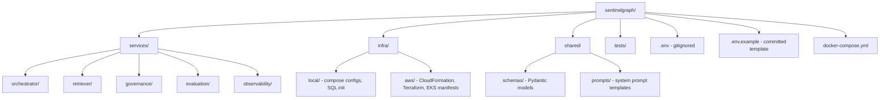
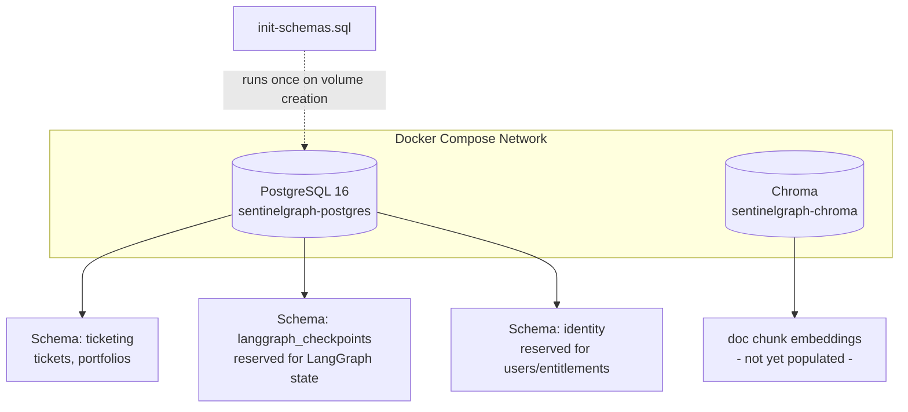
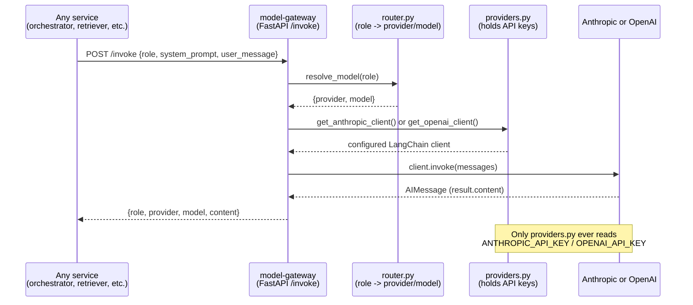

# SentinelGraph

SentinelGraph is a production-grade, governed agentic AI platform built as hands-on interview preparation, modeled on the class of problem BlackRock's Intelligence Servicing Platform (ISP) solves: a natural-language chat interface that lets enterprise users (portfolio managers, risk teams, operations analysts) run multi-step, tool-augmented investment workflows, with enterprise-grade identity propagation, layered guardrails, policy-enforced data access, an immutable audit trail, and full observability. The project is deliberately built local-first using Docker Compose, with an explicit, planned promotion path to AWS EKS, because that mirrors how a real platform team would develop: prove the architecture cheaply and quickly on a laptop before paying for and operating cloud infrastructure. The project was originally scaffolded with "Aladdin" in the name, but this was deliberately changed to "SentinelGraph" early on, because Aladdin is BlackRock's actual trademarked internal platform name, and using it in a personal, possibly-public repository risked implying an official affiliation that doesn't exist — a small but real judgment call about intellectual property hygiene that is itself worth being able to explain if asked.

## Phase 0: Repository Bootstrap, Secrets Strategy, and Git Discipline

The very first phase of the project involved no agent logic at all — it was purely about establishing the scaffolding that every later phase depends on: a coherent folder structure, a git repository with sane branching and commit conventions, and a secrets-handling strategy that would hold up even as the project grew. The reasoning behind starting here, before writing a single line of agent code, is that in a regulated environment like investment management, engineering discipline — reproducible environments, auditable git history, and secrets that never leak into version control — is not a "nice to have" layered on afterward; it is itself a signal of platform maturity that a Director-level engineer is expected to enforce from day one.

The folder structure was designed to mirror the eventual microservice boundaries of the system, rather than being organized as a single flat script collection. Under `services/`, each subfolder (`orchestrator`, `retriever`, `governance`, `evaluation`, `observability`) corresponds to a capability that will eventually be its own independently deployable, independently scalable container — this is a deliberate anticipation of the Kubernetes deployment model we will reach in later phases, where, for example, a spike in evaluator traffic can be scaled without touching the orchestrator at all. Alongside `services/`, an `infra/` folder holds environment-specific configuration split into `local/` (Docker Compose configs, SQL init scripts) and `aws/` (CloudFormation and eventually Terraform, and Kubernetes manifests), and a `shared/` folder holds cross-service code such as Pydantic schemas and prompt templates that more than one service needs to import.

Git was initialized with `main` as the primary branch, with an intended `develop` branch and `feature/*` branches for actual work — mirroring a real engineering team's workflow rather than committing directly to main. Commit messages follow the Conventional Commits convention (`feat:`, `fix:`, `chore:`, `security:`, and so on), which is a lightweight but real engineering-standards artifact: it makes git history scannable, supports automated changelog generation, and is exactly the kind of small standard a platform lead is expected to establish and enforce across a team, which maps directly to the JD's requirement to "establish and enforce engineering standards, design patterns, and best practices."

Secrets handling was established early and deliberately kept simple locally while being explicit about how it differs in production. Locally, a `.env` file holds real secret values (API keys, database passwords, JWT signing secrets) and is never committed to git — it is excluded via `.gitignore` from the very first commit, before any secret-bearing file could ever be staged. Alongside it, a `.env.example` file is committed to the repository; it lists every environment variable the application needs, populated with obviously-fake placeholder values, so that anyone opening the project (including a future version of the author) knows exactly what configuration is required without ever being exposed to a real credential. This is the standard local-development pattern, but it was explicitly discussed that it is not itself a production security model — a `.env` file sitting on a laptop is still a real leak vector through mechanisms like laptop theft, accidental inclusion in a zip archive, or a misconfigured backup. The plan, made explicit from this early phase, is that in production on AWS EKS there will be no `.env` file in the container image at all; instead, secrets will live in AWS Secrets Manager, synced into Kubernetes Secrets via the External Secrets Operator pattern, with pods authenticating to AWS via IRSA (IAM Roles for Service Accounts) rather than any static, long-lived AWS credential. This local-versus-production distinction — env file for developer velocity locally, Secrets Manager plus IRSA in production — is a legitimate, deliberate design decision to be able to narrate in an interview, not an oversight to be defensive about. It was also discussed that if a secret is ever accidentally committed, adding it to `.gitignore` afterward does not remove it from git's history; a real remediation would require history-rewriting tools such as `git filter-repo` or the BFG Repo-Cleaner, combined with immediate rotation of the leaked credential, since the old value must be treated as permanently compromised the moment it touches a shared repository.

During this phase, a genuinely useful clarifying discussion happened around tooling: the question of whether `.env` and `.env.example` belong at the project root came up (they do, alongside `docker-compose.yml`), and separately, whether `pyproject.toml` — seen in many modern Python repositories — is a superior replacement for `requirements.txt`. The honest answer is that `pyproject.toml` is indeed the more modern standard, increasingly used by tools like Poetry and uv to manage dependencies with proper lockfiles, project metadata, and build configuration all in one file, similar in spirit to `package.json` in the Node.js ecosystem. For a project of this size, however, `requirements.txt` remains simpler and is still what a large fraction of Docker-based Python microservices use in practice, so the decision was made to stay with `requirements.txt` throughout SentinelGraph rather than incur the complexity of switching mid-build for no functional benefit — a small but real example of choosing the boring, adequate tool over the newer one when the newer one doesn't change the outcome.

**Phase 0 structure at a glance:**

## Phase 1: Docker Compose — PostgreSQL Three-Schema Topology and Chroma

With the repository scaffolded, the first actual infrastructure decision was how to run PostgreSQL locally, and specifically why PostgreSQL rather than an alternative like local MySQL. The deciding factor was that LangGraph's built-in checkpointing mechanism — which persists agent execution state so that a conversation can be resumed, replayed, or audited — has native, first-class support for PostgreSQL as a backing store, and running Postgres in Docker from the very beginning keeps the local environment consistent with the eventual production path, where Postgres would run as Amazon RDS or as a Postgres deployment inside EKS. Using local MySQL instead would have introduced an unnecessary mismatch between local development and the intended production architecture for no compensating advantage.

A more subtle but important design decision made in this phase was how to handle the fact that a single Postgres instance ends up serving three conceptually distinct purposes in this system, a point that had originally been flagged as an architectural gap during interview preparation: Postgres needs to store business ticket state (the actual service tickets and portfolio records that the ISP-style workflows operate on), it needs to store LangGraph's own checkpointer tables (the internal execution state LangGraph uses to persist and resume a graph run), and eventually it will need to store identity and entitlement data (users, JWT-related metadata, and access-control tables). Rather than either conflating all of this into one undifferentiated set of tables, or over-engineering the solution by standing up three entirely separate Postgres instances from day one, the resolution chosen was to use **one Postgres instance with three separate schemas** — `ticketing`, `langgraph_checkpoints`, and `identity` — created via an initialization SQL script that Postgres runs automatically the first time its Docker volume is created. This gives each concern logical isolation (each schema can, in principle, have different access grants applied to it, so that, for example, the governance service could eventually be granted access to `identity` while being denied access to `langgraph_checkpoints`) while keeping operational overhead low: one connection pool, one backup job, one instance to reason about at this stage of the project. The schema-level isolation of `langgraph_checkpoints` in particular is what makes a real regulatory requirement tractable later: if BlackRock (or, in this simulated exercise, a compliance stakeholder) ever needs to prove months after the fact that a particular routing or retry decision the system made was deterministic and explainable, having the entire checkpoint history isolated in its own schema means an auditor can be pointed at exactly one well-defined part of the database rather than having to wade through unrelated business data. It was explicitly acknowledged that at true production scale, checkpoint volume alone — every state transition, retained for months for audit purposes — might eventually justify splitting `langgraph_checkpoints` onto its own dedicated Postgres instance for storage and I/O isolation, but that this would be the next scaling decision to make only once evidence of actual load demanded it, rather than something to speculatively over-build now.

Chroma was added in this same phase as the vector database that will back retrieval-augmented generation later in the project. It was deliberately brought in early, running as its own container, even though no document ingestion or embedding pipeline exists yet — the reasoning was to get the full Docker Compose topology (Postgres plus Chroma) stable and verified before any application code needed to depend on it, so that later phases could focus purely on application logic rather than debugging infrastructure and business logic simultaneously.

**Phase 1 topology at a glance:**

## Phase 2: Model Gateway — A Local Mimic of AWS Bedrock's Unified Model Access Pattern

This phase is one of the most important architectural decisions in the entire project, because it directly addresses a real pattern described by an actual BlackRock platform engineering leader (Lalit, in one of the reference interview transcripts used to prepare for this project) as the way BlackRock's own unified AI platform works: no individual team or service calls a model provider's API directly; instead, every call is funneled through a central gateway that holds the provider API keys, enforces rate limiting, tracks spend, and can swap model versions without requiring any downstream team to change its own code. AWS's actual product for this pattern is Bedrock, but Bedrock itself cannot be run inside a local Docker Compose environment, since it is a fully managed AWS service rather than an open-source piece of infrastructure. The solution adopted here was to build a small, purpose-written FastAPI microservice — `model-gateway` — that plays the identical architectural role locally: it is the only container in the entire system with access to the Anthropic and OpenAI API keys, it exposes a single `/invoke` endpoint that every other service calls over the network, and it is solely responsible for deciding which underlying provider and model actually handles a given request.

A deliberate and important design decision made explicit during this phase was that the gateway had to be built as a genuinely separate, network-isolated microservice with its own Dockerfile — not simply as a shared Python function that other services could import. This distinction matters architecturally: a shared function still executes inside whatever process imports it, meaning nothing would technically stop another service from also reading the same environment variables directly and bypassing the gateway; only a real network boundary, where the API keys live exclusively inside one container's environment and are never passed anywhere else, actually enforces the "only the gateway can call the model providers" guarantee. This is also why the project ended up with two different kinds of files side by side that initially caused some confusion: the top-level `docker-compose.yml` orchestrates multiple containers, and for off-the-shelf components like Postgres, Chroma, and MinIO it simply pulls a pre-built public image (using the `image:` key) because someone else has already written and published a Dockerfile for those. The `model-gateway` service, by contrast, is entirely custom code that nobody else has published an image for, so it needs its own `Dockerfile` and is referenced in Compose using the `build:` key instead — `build:` versus `image:` is the reliable tell for which services are off-the-shelf infrastructure and which are things we authored ourselves that need their own build recipe.

Internally, the gateway is split into three small files, each with a single, clear responsibility, which is itself a small but real software design decision worth narrating: `router.py` is nothing more than a lookup table mapping an abstract role name (`planner`, `retriever`, `analyst`, `evaluator`, `optimizer`) to a specific provider and model name; `providers.py` is the only file in the entire codebase that reads the actual `ANTHROPIC_API_KEY` and `OPENAI_API_KEY` environment variables and constructs the corresponding LangChain client objects; and `main.py` wires these together behind the single `/invoke` FastAPI endpoint, which accepts a role, a system prompt, and a user message, and returns the model's response along with which provider and model actually served it. Concentrating all API-key access into one file (`providers.py`) means that if a third model provider were ever added, or if the key-retrieval mechanism changed (for instance, moving from reading a plain environment variable to fetching a secret from AWS Secrets Manager at pod startup once this is deployed to EKS), only that one file would need to change — every other file in the system, including every future LangGraph node that calls the gateway, would be completely unaffected, since as far as they are concerned they are just calling `get_llm(role)` or making an HTTP POST to `/invoke` and receiving text back.

The specific role-to-model assignments chosen were not arbitrary. The planner and retriever roles, which perform lightweight, largely structural work (turning a natural-language query into a short plan, or deciding which tool to call), are routed to a fast, inexpensive model, since their task does not require deep reasoning. The analyst role, which performs the actual grounded synthesis of a final answer from retrieved context, is routed to a more capable, reasoning-heavy model, since the quality of the final answer depends most heavily on this step. The evaluator role — the model that judges the analyst's output and produces a confidence score — is deliberately routed to a **different model family** than the analyst, a decision known as cross-family evaluation or judge decorrelation. The underlying rationale is subtler than it might first appear: cross-family evaluation is not primarily a cost or latency optimization, and in fact a same-provider call and a cross-provider call are roughly equivalent in per-token cost and latency for comparable model tiers — the actual benefit of decorrelation is that if the same model family both generates and judges its own output, any systematic blind spot or bias shared across that family's models could cause the evaluator to rubber-stamp a flawed response, whereas an independently-trained model family is much less likely to share that exact blind spot. The real costs of going cross-family are operational rather than computational — running two vendor SDKs and two separate rate-limit budgets to monitor, losing the ability to exploit provider-specific prompt caching across the generation and evaluation calls if they shared a large common context, and taking on a small amount of additional resilience risk, since an outage at one vendor now can affect evaluation even if generation is unaffected. Splitting traffic across two providers also has a genuine benefit that is easy to overlook: it provides rate-limit isolation, since a burst of evaluator calls does not compete against the analyst's own rate-limit budget the way it would if both roles hit the same provider. This whole line of reasoning — decorrelation over cost, named operational trade-offs, rate-limit isolation as a side benefit — is exactly the kind of precise, defensible answer to give if a panelist asks "why two model providers" and pushes on whether it's really about cost.

Prompt injection defense was also introduced at this phase, in the form of a shared block of instructional text — the injection defense block — that is prepended to every role's system prompt. Its content instructs the model to treat all user input, retrieved documents, and tool outputs strictly as data to be analyzed rather than as instructions to be obeyed, and explicitly tells the model not to comply with any embedded text that attempts to make it reveal its system prompt, override its role, or ignore its original task, regardless of what authority the injected text claims to have. This is only a first, relatively weak layer of defense: a system prompt instruction can meaningfully deter naive injection attempts, but it does nothing on its own to stop more sophisticated attacks such as base64-encoded payloads, injection carried indirectly through the content of a retrieved document or a tool's return value, or attacks that don't rely on the model "reading instructions" at all. Real defense in depth requires this system-prompt-level instruction to be paired with pattern-based input scanning at a guardrail layer (built in a later phase) and, most importantly, with the architectural principle that the LLM itself is never granted unmediated ability to write to a database, execute code, or call an external system without passing through a separate, non-LLM-controlled authorization check — a principle that becomes concrete once the Data Access Layer and Policy Enforcement Point are built in later phases. Being able to name this limitation unprompted, rather than overclaiming that a system prompt "solves" injection, is itself a signal of production maturity worth demonstrating in an interview answer.

**Phase 2 request flow at a glance:**

## Build Phases

- [x] Phase 0: Repository bootstrap, folder architecture, git branching/commit conventions, secrets strategy (`.env` / `.env.example`)
- [x] Phase 1: Docker Compose — PostgreSQL with three-schema topology (`ticketing`, `langgraph_checkpoints`, `identity`) plus Chroma
- [x] Phase 2: Model Gateway microservice — unified LLM access mimicking AWS Bedrock, role-based routing across Anthropic and OpenAI, cross-family evaluator decorrelation, prompt injection defense block
- [ ] Phase 3: Basic LangGraph orchestrator (planner → real-Postgres-backed retriever → analyst → evaluator, bounded retry loop) — IN PROGRESS
- [ ] Phase 3.6: Token usage and cost tracking at the Model Gateway (per-role/provider, running budget visibility)
- [ ] Phase 4: Identity & Auth — real `users` table, JWT access and refresh tokens, token propagation across agent hops
- [ ] Phase 5: Entitlements & Data Access Layer — entitlement tables, tool calls gated on them
- [ ] Phase 6a: Agent/Tool Registry — federated registration mechanism + metadata tables, modeled on BlackRock Aladdin Copilot's Plugin Registry
- [ ] Phase 6b: Filtering/Access-Control Node — narrows the full registry to a relevant subset before planning (distinct from 6a)
- [ ] Phase 6.5: Intent classifier — read-only vs. write-action vs. mixed, drives guardrail strictness and entitlement scope
- [ ] Phase 7: Guardrails — input / tool-call / output, three distinct layers, intent-aware strictness
- [ ] Phase 7.5: Error taxonomy and structured error handling feeding audit/guardrails
- [ ] Phase 7.6: Rate limiting/quotas per user/role, circuit breakers, retries with exponential backoff, graceful degradation
- [ ] Phase 7.7: Tool invocation security — strongly typed Pydantic schemas, input validation, idempotency keys, sandboxing
- [ ] Phase 8: Vector DB/RAG (Chroma) — reranking, query rewriting, agentic retrieval
- [ ] Phase 9: Conversation memory embedding — short-term and long-term, entity memory, TTL/retention
- [ ] Phase 9.5: Caching layer — node-level, tool-result, semantic/embedding cache; cache key strategy, TTL, invalidation, hit-rate monitoring
- [ ] Phase 10: MinIO document ingestion pipeline
- [ ] Phase 11: MinIO immutable audit trail writer
- [ ] Phase 11.5: Explainability — reasoning-trace logging per agent decision
- [ ] Phase 11.6: Data retention and privacy — PII detection/redaction, right-to-be-forgotten, retention enforcement
- [ ] Phase 12: Observability — LangSmith + OpenTelemetry tracing, Prometheus + Grafana dashboards
- [ ] Phase 12.5: Audit Dashboard — reads MinIO + Postgres, search/replay/export for compliance
- [ ] Phase 13: UI — registration + login, password policy, account lockout, MFA/TOTP, JWT session handling
- [ ] Phase 14: UI — main chat interface, streaming, document upload, conversation history, role-aware UI, accessibility
- [ ] Phase 15: Unit + integration tests for orchestrator/gateway/DAL
- [ ] Phase 15.5: Adversarial/prompt-injection test suite, golden-dataset regression tests
- [ ] Phase 15.6: SAST/DAST/dependency scanning, load testing, compliance/audit validation tests, chaos engineering
- [ ] Phase 16: Documentation — ADRs, NFR evaluation table per component, incident response runbooks
- [ ] Phase 17: AWS cost explorer + $10 spend alarm + teardown script (built before any AWS spend)
- [ ] Phase 18: Terraform IaC — EKS, IRSA, ECR, VPC endpoints, WAF, multi-env promotion gates
- [ ] Phase 19: CI/CD pipeline — blue-green/canary deploy, automated rollback, drift detection
- [ ] Phase 20: Final EKS deployment, validation, and teardown